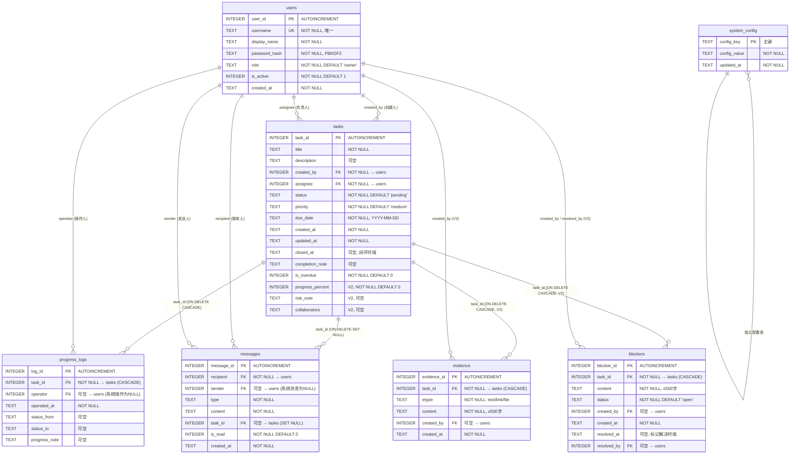

# 督办系统 — 数据库设计

> **文档版本**：v2.0（v1.0 + V2 迭代增补）  
> **编写日期**：2025-08（v1.0）/ 2026-08-28（v2.0 增补）  
> **数据库**：SQLite 3.x  
> **数据库文件**：`data/supervision.db`（运行时自动创建）  
> **V2 变更**：`tasks` 表新增 3 列（progress_percent / risk_note / collaborators），新增 `evidence`（过程证据）、`blockers`（阻塞记录）两张表及配套索引；V1 老库由 `models._migrate_v2()` 启动时自动迁移（见第 8 章）

---

## 目录

- [1. 数据库概览](#1-数据库概览)
- [2. ER 关系图](#2-er-关系图)
- [3. 表结构详细定义](#3-表结构详细定义)
  - [3.1 users — 用户表](#31-users--用户表)
  - [3.2 tasks — 任务表](#32-tasks--任务表)
  - [3.3 progress_logs — 进度记录表](#33-progress_logs--进度记录表)
  - [3.4 messages — 站内消息表](#34-messages--站内消息表)
  - [3.5 system_config — 系统配置表](#35-system_config--系统配置表)
  - [3.6 evidence — 过程证据表（V2 新增）](#36-evidence--过程证据表v2-新增)
  - [3.7 blockers — 阻塞记录表（V2 新增）](#37-blockers--阻塞记录表v2-新增)
- [4. 索引设计](#4-索引设计)
- [5. 表间关系说明](#5-表间关系说明)
- [6. 数据字典](#6-数据字典)
- [7. 初始化数据](#7-初始化数据)
- [8. V2 数据库迁移（老库无缝升级）](#8-v2-数据库迁移老库无缝升级)

---

## 1. 数据库概览

系统使用 SQLite 单文件数据库，共 **7 张表**（V1 为 5 张，V2 新增 2 张）：

| 表名 | 中文名 | 记录内容 | 预估数据量 |
|------|--------|---------|-----------|
| `users` | 用户表 | 系统所有用户（管理员 + 任务负责人） | 数十 |
| `tasks` | 任务表 | 所有督办任务（V2：含进度%/风险点/协同方 3 新列） | 数百~数千 |
| `progress_logs` | 进度记录表 | 任务状态变更与进度更新的时间线（V2：兼作证据/阻塞留痕时间线） | 数千~数万 |
| `messages` | 站内消息表 | 任务指派/状态变更/预警/管理员指令通知 | 数千~数万 |
| `system_config` | 系统配置表 | 预警天数、扫描间隔等可配置参数 | 个位数 |
| `evidence` | 过程证据表（V2 新增） | 任务推进过程中的文字/链接/文件名凭据 | 数千 |
| `blockers` | 阻塞记录表（V2 新增） | 任务卡点记录（待解决/已解决两态） | 数百~数千 |

**数据库文件路径**：`config.DATABASE_PATH` = `data/supervision.db`  
**连接配置**：`row_factory=sqlite3.Row`（字典式访问） + `PRAGMA foreign_keys = ON`（启用外键约束）

---

## 2. ER 关系图



---

## 3. 表结构详细定义

### 3.1 users — 用户表

存储系统所有用户信息，支持两种角色：`admin`（管理员）和 `owner`（任务负责人）。

| 字段名 | 类型 | 约束 | 默认值 | 说明 |
|--------|------|------|--------|------|
| `user_id` | INTEGER | PRIMARY KEY AUTOINCREMENT | — | 用户唯一标识 |
| `username` | TEXT | NOT NULL UNIQUE | — | 登录账号名，全局唯一 |
| `display_name` | TEXT | NOT NULL | — | 显示姓名（中文姓名） |
| `password_hash` | TEXT | NOT NULL | — | 密码哈希值（werkzeug PBKDF2） |
| `role` | TEXT | NOT NULL | `'owner'` | 角色：`admin` / `owner` |
| `is_active` | INTEGER | NOT NULL | `1` | 启用状态：1=启用, 0=停用 |
| `created_at` | TEXT | NOT NULL | — | 创建时间 `YYYY-MM-DD HH:MM:SS` |

**建表 SQL**：
```sql
CREATE TABLE IF NOT EXISTS users (
    user_id        INTEGER PRIMARY KEY AUTOINCREMENT,
    username       TEXT    NOT NULL UNIQUE,
    display_name   TEXT    NOT NULL,
    password_hash  TEXT    NOT NULL,
    role           TEXT    NOT NULL DEFAULT 'owner',
    is_active      INTEGER NOT NULL DEFAULT 1,
    created_at     TEXT    NOT NULL
);
```

**字段补充说明**：
- `role` 取值范围：`admin`（管理员，可管理所有任务和用户）、`owner`（任务负责人，可查看全部任务但仅编辑自己的）
- `is_active` 为 0 时用户无法登录（`do_login` 中校验），但历史数据保留
- `password_hash` 使用 werkzeug 的 `generate_password_hash()` 生成，格式为 `pbkdf2:sha256:...`

---

### 3.2 tasks — 任务表

存储所有督办任务，是系统的核心数据表。

| 字段名 | 类型 | 约束 | 默认值 | 说明 |
|--------|------|------|--------|------|
| `task_id` | INTEGER | PRIMARY KEY AUTOINCREMENT | — | 任务唯一标识 |
| `title` | TEXT | NOT NULL | — | 任务标题（最长 100 字） |
| `description` | TEXT | — | NULL | 工作要求/描述 |
| `created_by` | INTEGER | NOT NULL, FK → users(user_id) | — | 创建人 user_id |
| `assignee` | INTEGER | NOT NULL, FK → users(user_id) | — | 负责人 user_id |
| `status` | TEXT | NOT NULL | `'pending'` | 任务状态（5 态） |
| `priority` | TEXT | NOT NULL | `'medium'` | 优先级（4 级） |
| `due_date` | TEXT | NOT NULL | — | 截止日期 `YYYY-MM-DD` |
| `created_at` | TEXT | NOT NULL | — | 创建时间 |
| `updated_at` | TEXT | NOT NULL | — | 最后更新时间 |
| `closed_at` | TEXT | — | NULL | 闭环时间（转为 closed 时填） |
| `completion_note` | TEXT | — | NULL | 完成说明（闭环备注） |
| `is_overdue` | INTEGER | NOT NULL | `0` | 逾期标记：1=已逾期, 0=未逾期 |
| `progress_percent` | INTEGER | NOT NULL | `0` | **V2 新增**：进度百分比 0–100，应用层校验 |
| `risk_note` | TEXT | — | NULL | **V2 新增**：风险点说明，上限 500 字（应用层校验） |
| `collaborators` | TEXT | — | NULL | **V2 新增**：协同方（逗号分隔姓名），上限 500 字 |

**建表 SQL**：
```sql
CREATE TABLE IF NOT EXISTS tasks (
    task_id          INTEGER PRIMARY KEY AUTOINCREMENT,
    title            TEXT    NOT NULL,
    description      TEXT,
    created_by       INTEGER NOT NULL,
    assignee         INTEGER NOT NULL,
    status           TEXT    NOT NULL DEFAULT 'pending',
    priority         TEXT    NOT NULL DEFAULT 'medium',
    due_date         TEXT    NOT NULL,
    created_at       TEXT    NOT NULL,
    updated_at       TEXT    NOT NULL,
    closed_at        TEXT,
    completion_note  TEXT,
    is_overdue       INTEGER NOT NULL DEFAULT 0,
    progress_percent INTEGER NOT NULL DEFAULT 0,        -- V2 新增：进度百分比 0-100
    risk_note        TEXT,                              -- V2 新增：风险点说明
    collaborators    TEXT,                              -- V2 新增：协同方（逗号分隔姓名）
    FOREIGN KEY (created_by) REFERENCES users(user_id),
    FOREIGN KEY (assignee)    REFERENCES users(user_id)
);
```

**字段取值字典**：

| 字段 | 取值 | 中文标签 | 说明 |
|------|------|---------|------|
| `status` | `pending` | 待启动 | 初始状态，任务已创建尚未开始 |
| `status` | `in_progress` | 进行中 | 负责人已开始执行 |
| `status` | `overdue` | 已逾期 | 超过截止日期，系统自动标记 |
| `status` | `closed` | 已闭环 | 任务已完成 |
| `status` | `cancelled` | 已撤销 | 任务被取消 |
| `priority` | `urgent` | 紧急 | 最高优先级 |
| `priority` | `high` | 高 | — |
| `priority` | `medium` | 中 | 默认值 |
| `priority` | `low` | 低 | — |

---

### 3.3 progress_logs — 进度记录表

记录任务状态变更和进度更新的完整时间线，用于详情页进度追踪。

| 字段名 | 类型 | 约束 | 默认值 | 说明 |
|--------|------|------|--------|------|
| `log_id` | INTEGER | PRIMARY KEY AUTOINCREMENT | — | 记录唯一标识 |
| `task_id` | INTEGER | NOT NULL, FK → tasks(task_id) ON DELETE CASCADE | — | 关联任务 ID |
| `operator` | INTEGER | FK → users(user_id) | NULL | 操作人 user_id（系统自动操作为 NULL） |
| `operated_at` | TEXT | NOT NULL | — | 操作时间 |
| `status_from` | TEXT | — | NULL | 变更前状态 |
| `status_to` | TEXT | — | NULL | 变更后状态 |
| `progress_note` | TEXT | — | NULL | 进度备注 |

**建表 SQL**：
```sql
CREATE TABLE IF NOT EXISTS progress_logs (
    log_id         INTEGER PRIMARY KEY AUTOINCREMENT,
    task_id        INTEGER NOT NULL,
    operator       INTEGER,
    operated_at    TEXT    NOT NULL,
    status_from    TEXT,
    status_to      TEXT,
    progress_note  TEXT,
    FOREIGN KEY (task_id)  REFERENCES tasks(task_id) ON DELETE CASCADE,
    FOREIGN KEY (operator) REFERENCES users(user_id)
);
```

**字段补充说明**：
- `operator` 为 NULL 表示系统自动操作（如逾期扫描自动标记 overdue）
- `status_from` 和 `status_to` 相同表示仅提交进度备注，未改变状态
- 级联删除：删除任务时自动删除关联的进度记录（`ON DELETE CASCADE`）

---

### 3.4 messages — 站内消息表

存储所有站内通知消息，包括任务指派、状态变更、三层预警和管理员指令。

| 字段名 | 类型 | 约束 | 默认值 | 说明 |
|--------|------|------|--------|------|
| `message_id` | INTEGER | PRIMARY KEY AUTOINCREMENT | — | 消息唯一标识 |
| `recipient` | INTEGER | NOT NULL, FK → users(user_id) | — | 接收人 user_id |
| `sender` | INTEGER | FK → users(user_id) | NULL | 发送人 user_id（系统消息为 NULL） |
| `type` | TEXT | NOT NULL | — | 消息类型 |
| `content` | TEXT | NOT NULL | — | 消息正文 |
| `task_id` | INTEGER | FK → tasks(task_id) ON DELETE SET NULL | NULL | 关联任务 ID（点击跳转用） |
| `is_read` | INTEGER | NOT NULL | `0` | 已读状态：1=已读, 0=未读 |
| `created_at` | TEXT | NOT NULL | — | 创建时间 |

**建表 SQL**：
```sql
CREATE TABLE IF NOT EXISTS messages (
    message_id   INTEGER PRIMARY KEY AUTOINCREMENT,
    recipient    INTEGER NOT NULL,
    sender       INTEGER,
    type         TEXT    NOT NULL,
    content      TEXT    NOT NULL,
    task_id      INTEGER,
    is_read      INTEGER NOT NULL DEFAULT 0,
    created_at   TEXT    NOT NULL,
    FOREIGN KEY (recipient) REFERENCES users(user_id),
    FOREIGN KEY (sender)   REFERENCES users(user_id),
    FOREIGN KEY (task_id)  REFERENCES tasks(task_id) ON DELETE SET NULL
);
```

**消息类型字典**：

| `type` 取值 | 中文标签 | 颜色 | 触发场景 | 通知对象 |
|-------------|---------|------|---------|---------|
| `assignment` | 任务指派 | blue | 创建任务 / 批量指派 | 被指派的负责人 |
| `status_change` | 状态变更 | gray | 手动变更任务状态 | 任务相关方（非操作人） |
| `warning_due` | 到期预警 | orange | 截止日期前 N 天 | 负责人 |
| `warning_overdue` | 逾期预警 | red | 任务超过截止日期 | 负责人 + 所有管理员 |
| `warning_inactive` | 待激活预警 | yellow | 创建超 N 天仍未启动 | 负责人 + 所有管理员 |
| `admin_directive` | 管理员指令 | purple | 管理员手动发消息 | 指定接收人 |

**字段补充说明**：
- `sender` 为 NULL 表示系统自动发送的预警消息
- `task_id` 在任务被删除时置为 NULL（`ON DELETE SET NULL`），保留历史消息可查
- 预警去重：`has_warning_today()` 按 `task_id + recipient + type + created_at LIKE 'YYYY-MM-DD%'` 查询

---

### 3.5 system_config — 系统配置表

存储可动态修改的系统配置项，覆盖 `config.py` 中的默认值。

| 字段名 | 类型 | 约束 | 默认值 | 说明 |
|--------|------|------|--------|------|
| `config_key` | TEXT | PRIMARY KEY | — | 配置键名 |
| `config_value` | TEXT | NOT NULL | — | 配置值（字符串形式存储） |
| `updated_at` | TEXT | NOT NULL | — | 最后更新时间 |

**建表 SQL**：
```sql
CREATE TABLE IF NOT EXISTS system_config (
    config_key    TEXT    PRIMARY KEY,
    config_value  TEXT    NOT NULL,
    updated_at    TEXT    NOT NULL
);
```

**初始化配置项**：

| `config_key` | `config_value` 默认值 | 来源 | 说明 |
|-------------|----------------------|------|------|
| `warning_due_days` | `3` | `config.DEFAULT_WARNING_DUE_DAYS` | 即将到期预警天数 |
| `warning_inactive_days` | `7` | `config.DEFAULT_WARNING_INACTIVE_DAYS` | 长期待激活预警天数 |
| `scan_interval_seconds` | `300` | `config.OVERDUE_SCAN_INTERVAL` | 逾期扫描间隔（秒） |
| `warning_scan_time` | `09:00` | `config.WARNING_SCAN_TIME` | 每日预警扫描时间 |

**写入方式**：`INSERT OR IGNORE`，保证重复调用 `init_db()` 不会覆盖已有配置值。

---

### 3.6 evidence — 过程证据表（V2 新增）

存储任务推进过程中的凭据记录。类型三选一：text（文字说明）/ link（链接）/ file（文件名，不真正上传文件本体）。

| 字段名 | 类型 | 约束 | 默认值 | 说明 |
|--------|------|------|--------|------|
| `evidence_id` | INTEGER | PRIMARY KEY AUTOINCREMENT | — | 证据唯一标识 |
| `task_id` | INTEGER | NOT NULL, FK → tasks(task_id) ON DELETE CASCADE | — | 关联任务 ID |
| `etype` | TEXT | NOT NULL | — | 证据类型：`text` / `link` / `file` |
| `content` | TEXT | NOT NULL | — | 文字内容 / URL / 文件名，上限 500 字 |
| `created_by` | INTEGER | FK → users(user_id) | NULL | 创建人 user_id |
| `created_at` | TEXT | NOT NULL | — | 创建时间 |

**建表 SQL**：
```sql
CREATE TABLE IF NOT EXISTS evidence (
    evidence_id  INTEGER PRIMARY KEY AUTOINCREMENT,
    task_id      INTEGER NOT NULL,
    etype        TEXT    NOT NULL,
    content      TEXT    NOT NULL,
    created_by   INTEGER,
    created_at   TEXT    NOT NULL,
    FOREIGN KEY (task_id)    REFERENCES tasks(task_id) ON DELETE CASCADE,
    FOREIGN KEY (created_by) REFERENCES users(user_id)
);
```

**字段补充说明**：
- 添加权限：owner 仅能给自己的任务添加，admin 可给所有任务添加（路由层校验）
- 删除权限：仅 admin（`POST /tasks/<id>/evidence/<eid>/delete`），删除写入时间线留痕
- 证据必须属于对应任务：跨任务 ID 访问返回 404
- 添加/删除操作自动写入 `progress_logs` 一条纯备注型日志（`status_from`/`status_to` 为 NULL）

---

### 3.7 blockers — 阻塞记录表（V2 新增）

存储任务推进过程中的卡点（阻塞）记录，状态两态：open（待解决）/ resolved（已解决）。

| 字段名 | 类型 | 约束 | 默认值 | 说明 |
|--------|------|------|--------|------|
| `blocker_id` | INTEGER | PRIMARY KEY AUTOINCREMENT | — | 阻塞记录唯一标识 |
| `task_id` | INTEGER | NOT NULL, FK → tasks(task_id) ON DELETE CASCADE | — | 关联任务 ID |
| `content` | TEXT | NOT NULL | — | 阻塞描述，上限 500 字 |
| `status` | TEXT | NOT NULL | `'open'` | 状态：`open`（待解决）/ `resolved`（已解决） |
| `created_by` | INTEGER | FK → users(user_id) | NULL | 创建人 user_id |
| `created_at` | TEXT | NOT NULL | — | 创建时间 |
| `resolved_at` | TEXT | — | NULL | 解决时间（标记解决时写入） |
| `resolved_by` | INTEGER | FK → users(user_id) | NULL | 解决人 user_id（标记解决时写入） |

**建表 SQL**：
```sql
CREATE TABLE IF NOT EXISTS blockers (
    blocker_id   INTEGER PRIMARY KEY AUTOINCREMENT,
    task_id      INTEGER NOT NULL,
    content      TEXT    NOT NULL,
    status       TEXT    NOT NULL DEFAULT 'open',
    created_by   INTEGER,
    created_at   TEXT    NOT NULL,
    resolved_at  TEXT,
    resolved_by  INTEGER,
    FOREIGN KEY (task_id)    REFERENCES tasks(task_id) ON DELETE CASCADE,
    FOREIGN KEY (created_by) REFERENCES users(user_id)
);
```

**字段补充说明**：
- 添加权限：owner 仅自己的任务，admin 所有任务；解决权限：admin 或记录创建者本人；删除仅 admin
- 重复解决（status 已为 resolved）返回 400
- 添加/解决/删除操作均写入 `progress_logs` 时间线留痕
- 级联删除：删除任务时自动删除关联阻塞记录

---

## 4. 索引设计

系统共创建 **12 个索引**（V1 为 10 个，V2 新增 2 个），覆盖高频查询路径：

| 索引名 | 表 | 索引字段 | 查询场景 |
|--------|-----|---------|---------|
| `idx_tasks_status` | tasks | status | 按状态筛选任务列表 |
| `idx_tasks_assignee` | tasks | assignee | 按负责人筛选任务 |
| `idx_tasks_due_date` | tasks | due_date | 按截止日期排序、逾期扫描 |
| `idx_tasks_is_overdue` | tasks | is_overdue | 逾期标记查询 |
| `idx_tasks_created_by` | tasks | created_by | 按创建人查询任务 |
| `idx_logs_task_id` | progress_logs | task_id | 查询任务的进度记录 |
| `idx_logs_operated_at` | progress_logs | operated_at | 按时间排序进度记录 |
| `idx_messages_recipient` | messages | recipient | 查询用户的消息列表 |
| `idx_messages_is_read` | messages | is_read | 未读消息数统计（红点轮询） |
| `idx_messages_created` | messages | created_at | 按时间倒序排列消息 |
| `idx_evidence_task` | evidence | task_id | **V2 新增**：按任务查证据列表（抽屉页签） |
| `idx_blockers_task` | blockers | task_id | **V2 新增**：按任务查阻塞列表（抽屉页签） |

**建索引 SQL**：
```sql
CREATE INDEX IF NOT EXISTS idx_tasks_status      ON tasks(status);
CREATE INDEX IF NOT EXISTS idx_tasks_assignee    ON tasks(assignee);
CREATE INDEX IF NOT EXISTS idx_tasks_due_date    ON tasks(due_date);
CREATE INDEX IF NOT EXISTS idx_tasks_is_overdue  ON tasks(is_overdue);
CREATE INDEX IF NOT EXISTS idx_tasks_created_by  ON tasks(created_by);
CREATE INDEX IF NOT EXISTS idx_logs_task_id      ON progress_logs(task_id);
CREATE INDEX IF NOT EXISTS idx_logs_operated_at  ON progress_logs(operated_at);
CREATE INDEX IF NOT EXISTS idx_messages_recipient ON messages(recipient);
CREATE INDEX IF NOT EXISTS idx_messages_is_read   ON messages(is_read);
CREATE INDEX IF NOT EXISTS idx_messages_created   ON messages(created_at);

-- V2 新增表索引（高频查询：按任务查证据/阻塞列表）
CREATE INDEX IF NOT EXISTS idx_evidence_task ON evidence(task_id);
CREATE INDEX IF NOT EXISTS idx_blockers_task ON blockers(task_id);
```

---

## 5. 表间关系说明

### 5.1 关系总览

| 关系 | 类型 | 说明 |
|------|------|------|
| users → tasks (created_by) | 一对多 | 一个用户可创建多个任务 |
| users → tasks (assignee) | 一对多 | 一个用户可被指派多个任务 |
| tasks → progress_logs | 一对多 | 一个任务有多条进度记录，级联删除 |
| tasks → messages | 一对多 | 一个任务可关联多条消息，删除时 task_id 置 NULL |
| users → progress_logs (operator) | 一对多 | 一个用户可操作多条进度记录 |
| users → messages (recipient) | 一对多 | 一个用户接收多条消息 |
| users → messages (sender) | 一对多 | 一个用户发送多条消息 |
| tasks → evidence (V2) | 一对多 | 一个任务多条过程证据，级联删除 |
| tasks → blockers (V2) | 一对多 | 一个任务多条阻塞记录，级联删除 |
| users → evidence (created_by, V2) | 一对多 | 一个用户可添加多条证据 |
| users → blockers (created_by / resolved_by, V2) | 一对多 | 一个用户可添加/解决多条阻塞 |

### 5.2 外键约束策略

| 外键 | 策略 | 原因 |
|------|------|------|
| tasks.created_by → users | RESTRICT（默认） | 不允许删除有任务的用户 |
| tasks.assignee → users | RESTRICT（默认） | 不允许删除有负责任务的用户 |
| progress_logs.task_id → tasks | ON DELETE CASCADE | 删除任务时自动清理进度记录 |
| progress_logs.operator → users | RESTRICT（默认） | 保留操作人引用（实际可通过停用代替删除） |
| messages.recipient → users | RESTRICT（默认） | 不允许删除有消息的用户 |
| messages.sender → users | RESTRICT（默认） | 保留发送人引用 |
| messages.task_id → tasks | ON DELETE SET NULL | 删除任务时消息保留，task_id 置 NULL |
| evidence.task_id → tasks (V2) | ON DELETE CASCADE | 删除任务时过程证据一并清理 |
| evidence.created_by → users (V2) | RESTRICT（默认） | 保留创建人引用 |
| blockers.task_id → tasks (V2) | ON DELETE CASCADE | 删除任务时阻塞记录一并清理 |
| blockers.created_by / resolved_by → users (V2) | RESTRICT（默认） | 保留操作人引用 |

### 5.3 查询中的 JOIN 关系

**任务列表查询**（`models.get_tasks`）：
```sql
SELECT t.*, 
       u_assignee.display_name AS assignee_name, 
       u_creator.display_name AS creator_name
FROM tasks t
LEFT JOIN users u_assignee ON t.assignee = u_assignee.user_id
LEFT JOIN users u_creator  ON t.created_by = u_creator.user_id
WHERE ... ORDER BY ... LIMIT ? OFFSET ?
```

**进度记录查询**（`models.get_progress_logs`）：
```sql
SELECT pl.*, u.display_name AS operator_name
FROM progress_logs pl
LEFT JOIN users u ON pl.operator = u.user_id
WHERE pl.task_id = ? ORDER BY pl.operated_at DESC
```

**消息列表查询**（`models.get_messages`）：
```sql
SELECT m.*, u.display_name AS sender_name, t.title AS task_title
FROM messages m
LEFT JOIN users u ON m.sender = u.user_id
LEFT JOIN tasks t ON m.task_id = t.task_id
WHERE m.recipient = ? ORDER BY m.created_at DESC
```

---

## 6. 数据字典

### 6.1 任务状态流转矩阵

| 当前状态 \ 允许目标 | in_progress | closed | cancelled | pending | overdue(自动) |
|---------------------|:-----------:|:------:|:---------:|:-------:|:-------------:|
| **pending** (待启动) | ✅ | ✅ | ✅ | — | ✅ 自动 |
| **in_progress** (进行中) | — | ✅ | ✅ | — | ✅ 自动 |
| **overdue** (已逾期) | ✅ | ✅ | ✅ | — | — |
| **closed** (已闭环) | ✅ 仅管理员 | — | — | — | — |
| **cancelled** (已撤销) | — | — | — | ✅ 仅管理员 | — |

> 注：`overdue` 状态由后台逾期扫描线程自动触发，不在手动转换矩阵中。

### 6.2 优先级排序权重

用于 `models.get_tasks` 中 `priority_asc` / `priority_desc` 排序：

| 优先级 | 排序权重 |
|--------|---------|
| `urgent` | 1 |
| `high` | 2 |
| `medium` | 3 |
| `low` | 4 |

### 6.3 角色权限矩阵

| 操作 | admin | owner | 说明 |
|------|:-----:|:-----:|------|
| 查看所有任务 | ✅ | ✅ 只读 | owner 可看全部，仅能编辑自己的 |
| 创建任务 | ✅ 指派任意人 | ✅ 仅指派给自己 | owner 创建时 assignee 强制为自己 |
| 编辑任务 | ✅ 所有任务 | ✅ 仅自己负责的 | `can_edit_task()` 判断 |
| 变更状态 | ✅ 所有任务 | ✅ 仅自己负责的 | 含管理员专属转换 |
| 重新打开已闭环 | ✅ | ❌ | `closed → in_progress` 仅管理员 |
| 重新激活已撤销 | ✅ | ❌ | `cancelled → pending` 仅管理员 |
| 删除任务 | ✅ 仅已撤销 | ❌ | `can_delete_task()` 判断 |
| 用户管理 | ✅ | ❌ | `@admin_required` |
| 系统设置 | ✅ | ❌ | `@admin_required` |
| 发送指令消息 | ✅ | ❌ | `@admin_required` |
| 批量指派 | ✅ | ❌ | reassign 仅管理员 |
| 添加证据/阻塞（V2） | ✅ 所有任务 | ✅ 仅自己负责的 | owner 他人任务 403 |
| 删除证据/阻塞（V2） | ✅ | ❌ | 仅 admin，跨任务 ID 404 |
| 标记阻塞解决（V2） | ✅ | ✅ 记录创建者本人 | 非创建者非 admin 403 |
| 行内编辑（V2） | ✅ 所有任务 | ✅ 仅自己负责的 | 复用 `can_edit_task` |
| 行内改派 assignee（V2） | ✅ | ❌ | 仅 admin，改派自动发指派消息 |
| 推送提醒（V2） | ✅ | ❌ | `POST /tasks/remind` 内部校验 admin |

---

## 7. 初始化数据

### 7.1 默认系统配置

首次启动 `models.init_db()` 时自动写入以下配置（`INSERT OR IGNORE`）：

| config_key | config_value | 说明 |
|-----------|-------------|------|
| `warning_due_days` | `3` | 到期预警提前天数 |
| `warning_inactive_days` | `7` | 待激活预警天数 |
| `scan_interval_seconds` | `300` | 逾期扫描间隔（5 分钟） |
| `warning_scan_time` | `09:00` | 每日预警扫描时间 |

### 7.2 演示数据（可选）

通过命令行 `python app.py --seed-demo` 灌入演示数据：

| 数据 | 数量 | 说明 |
|------|------|------|
| 用户 | 5 | 1 管理员 (admin/admin123) + 4 负责人 (密码均为 123456) |
| 任务 | 12 | 待启动 3 / 进行中 4 / 已逾期 2 / 已闭环 2 / 已撤销 1 |
| 消息 | 10 | 3 已读 + 7 未读 |

清除演示数据：`python app.py --clear-demo`

---

## 8. V2 数据库迁移（老库无缝升级）

V1 老数据库无需手工操作，启动时自动升级到 V2 结构。迁移逻辑位于 **`models.py` 的 `_migrate_v2()`**（`db.py` 仅提供连接与事务，不含迁移逻辑），由 `init_db()` 末尾调用：

```
init_db()
 ├── 建表（CREATE TABLE IF NOT EXISTS × 5 张 V1 表）
 ├── 建索引 + 写默认配置
 └── _migrate_v2()                     # V2 迁移，幂等可重复调用
      ├── ① CREATE TABLE IF NOT EXISTS evidence / blockers + 索引
      │      （IF NOT EXISTS 天然幂等，新老库统一走这一步）
      └── ② tasks 补 3 列
             PRAGMA table_info(tasks) 取现有列名集合
             逐列检查 progress_percent / risk_note / collaborators
             缺列才执行 ALTER TABLE tasks ADD COLUMN <col> <def>
             （SQLite ADD COLUMN 秒级完成，数据不丢）
```

**设计要点**：

| 要点 | 说明 |
|------|------|
| 幂等性 | 建表走 IF NOT EXISTS；补列先查 `PRAGMA table_info` 再 ALTER，重复启动零副作用 |
| 数据安全 | 只做加表/加列（带默认值），不修改、不删除任何 V1 数据 |
| 容错 | 迁移整体 try/except，异常打印日志（`[migrate_v2]` 前缀）但**不中断启动** |
| 时机 | 应用启动 `init_db()` 时执行，与首次建库共用同一条路径 |

---

> **文档结束** — 督办系统数据库设计 v2.0（v1.0 基线 + V2 迭代增补：7 张表 / 12 个索引 / 老库自动迁移）
