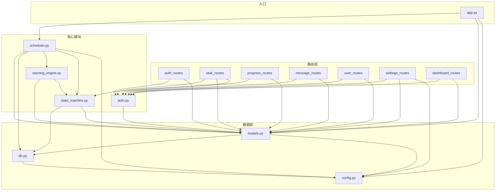

# 督办系统 — 模块详细设计

> **文档版本**：v2.0（v1.0 + V2 迭代增补）  
> **编写日期**：2025-08（v1.0）/ 2026-08-28（v2.0 增补）  
> **覆盖范围**：8 个核心 Python 模块 + 7 个路由模块（+ 前端交互脚本与图标宏）
> **V2 变更摘要**：`models.py` 新增 `_migrate_v2()` 迁移与 evidence/blockers CRUD、仪表盘 V2 统计三函数；`routes/task_routes.py` 新增 11 个 V2 端点（详见接口设计第 10 章）；`routes/message_routes.py` 新增消息抽屉片段路由、`/messages` 改 301；`routes/auth_routes.py` 登录字段级错误 + 记住用户名；`static/js/main.js` V2 重写（抽屉管理器/行内编辑/Toast/深色切换）；`templates/macros/icons.html` 新增 Lucide 图标宏。各模块核心职责与调用关系不变。

---

## 目录

- [1. 模块总览](#1-模块总览)
- [2. config.py — 配置管理模块](#2-configpy--配置管理模块)
- [3. db.py — 数据库连接管理模块](#3-dbpy--数据库连接管理模块)
- [4. models.py — 数据访问层模块](#4-modelspy--数据访问层模块)
- [5. auth.py — 认证与权限模块](#5-authpy--认证与权限模块)
- [6. state_machine.py — 任务状态机模块](#6-state_machinepy--任务状态机模块)
- [7. warning_engine.py — 三层预警引擎模块](#7-warning_enginepy--三层预警引擎模块)
- [8. scheduler.py — 后台调度模块](#8-schedulerpy--后台调度模块)
- [9. app.py — 应用工厂与启动模块](#9-apppy--应用工厂与启动模块)
- [10. routes/ — 路由模块](#10-routes--路由模块)
- [11. 模块调用关系图](#11-模块调用关系图)
- [12. V2 新增模块与函数速览（v2.0 增补）](#12-v2-新增模块与函数速览v20-增补)

---

## 1. 模块总览

| 模块 | 文件 | 行数 | 核心职责 |
|------|------|------|---------|
| 配置管理 | `config.py` | ~103 | 全局配置集中管理（路径/安全/分页/扫描/预警） |
| 数据库连接 | `db.py` | ~135 | 线程安全 SQLite 连接管理 + 事务控制 |
| 数据访问层 | `models.py` | ~629 | 建表 + 用户/任务/进度/消息/配置/仪表盘 CRUD |
| 认证权限 | `auth.py` | ~217 | 密码哈希 + 登录/登出 + 权限装饰器 + 数据级权限 |
| 状态机 | `state_machine.py` | ~255 | 5 态状态枚举 + 转换矩阵 + 状态变更完整流程 |
| 预警引擎 | `warning_engine.py` | ~146 | 三层预警判定 + 合并去重发送 |
| 后台调度 | `scheduler.py` | ~134 | 逾期扫描线程 + 预警扫描线程 |
| 应用工厂 | `app.py` | ~367 | Flask 应用创建 + 初始化 + 启动入口 |
| 路由注册 | `routes/__init__.py` | ~37 | 统一注册 7 个 Blueprint |
| 认证路由 | `routes/auth_routes.py` | ~111 | 登录/登出/初始化向导 |
| 任务路由 | `routes/task_routes.py` | ~537 | 任务 CRUD + 状态变更 + 导出 + 批量 |
| 进度路由 | `routes/progress_routes.py` | ~80 | 进度提交 + 日志查询 |
| 消息路由 | `routes/message_routes.py` | ~158 | 消息列表/已读/未读数/发消息 |
| 用户路由 | `routes/user_routes.py` | ~125 | 用户管理（增/停用/重置密码） |
| 设置路由 | `routes/settings_routes.py` | ~123 | 个人设置 + 系统设置 |
| 仪表盘路由 | `routes/dashboard_routes.py` | ~36 | 仪表盘概览 |

---

## 2. config.py — 配置管理模块

### 2.1 职责说明

集中管理系统所有全局配置项，分为六大类：路径配置、安全配置、分页配置、后台扫描配置、预警默认值、服务器配置。支持 PyInstaller 打包环境自动适配路径。

### 2.2 配置项清单

| 配置项 | 类型 | 默认值 | 说明 |
|--------|------|--------|------|
| `FROZEN` | bool | `getattr(sys, 'frozen', False)` | PyInstaller 冻结检测 |
| `BASE_DIR` | str | 源码目录或 exe 目录 | 运行根目录（数据库存放位置） |
| `BUNDLE_DIR` | str | `sys._MEIPASS` 或源码目录 | 资源目录（模板/静态文件位置） |
| `TEMPLATE_DIR` | str | `BUNDLE_DIR/templates` | Jinja2 模板路径 |
| `STATIC_DIR` | str | `BUNDLE_DIR/static` | 静态资源路径 |
| `DATA_DIR` | str | `BASE_DIR/data` | 数据目录 |
| `DATABASE_PATH` | str | `DATA_DIR/supervision.db` | SQLite 数据库文件路径 |
| `SECRET_KEY` | str | 硬编码 | Flask session 签名密钥 |
| `PERMANENT_SESSION_LIFETIME` | int | `604800` | Session 有效期（7 天，秒） |
| `TASKS_PER_PAGE` | int | `20` | 任务列表每页条数 |
| `MESSAGES_PER_PAGE` | int | `20` | 消息列表每页条数 |
| `OVERDUE_SCAN_INTERVAL` | int | `300` | 逾期扫描间隔（秒） |
| `WARNING_CHECK_INTERVAL` | int | `60` | 预警扫描检查间隔（秒） |
| `WARNING_SCAN_TIME` | str | `'09:00'` | 每日预警扫描时间 |
| `DEFAULT_WARNING_DUE_DAYS` | int | `3` | 到期预警默认天数 |
| `DEFAULT_WARNING_INACTIVE_DAYS` | int | `7` | 待激活预警默认天数 |
| `HOST` | str | `'0.0.0.0'` | 监听地址 |
| `PORT` | int | `5000` | 监听端口 |
| `DEBUG` | bool | `False` | 调试模式 |
| `UNREAD_POLL_INTERVAL_MS` | int | `30000` | 前端消息轮询间隔（毫秒） |

### 2.3 关键设计：PyInstaller 路径适配

```python
if FROZEN:
    BASE_DIR = os.path.dirname(sys.executable)    # exe 同级目录
    BUNDLE_DIR = sys._MEIPASS                      # 临时解压目录
else:
    BASE_DIR = os.path.dirname(os.path.abspath(__file__))  # 源码目录
    BUNDLE_DIR = BASE_DIR
```

**设计意图**：数据库文件存放在 `BASE_DIR`（exe 同级，数据持久化），模板/静态资源从 `BUNDLE_DIR` 读取（打包后为临时解压目录）。

---

## 3. db.py — 数据库连接管理模块

### 3.1 职责说明

提供线程安全的 SQLite 连接管理和统一的数据操作接口。核心机制：每个线程持有独立连接（`threading.local`）+ 全局写锁保证事务原子性。

### 3.2 关键函数签名

```python
def get_db() -> sqlite3.Connection
```
- **功能**：获取当前线程的数据库连接，首次调用时创建并缓存
- **连接配置**：`row_factory=sqlite3.Row` + `check_same_thread=False` + `PRAGMA foreign_keys = ON`
- **返回**：当前线程的 SQLite Connection 对象

```python
@contextmanager
def transaction() -> Generator[sqlite3.Connection, None, None]
```
- **功能**：事务上下文管理器，加全局锁，无异常自动提交，有异常自动回滚
- **用法**：`with transaction() as conn: conn.execute(...)`
- **线程安全**：内部使用 `_lock = threading.Lock()` 保证多线程并发写的串行化

```python
def query(sql: str, params: tuple = ()) -> list[sqlite3.Row]
```
- **功能**：SELECT 查询快捷方法
- **返回**：结果行列表，空结果返回 `[]`

```python
def query_one(sql: str, params: tuple = ()) -> sqlite3.Row | None
```
- **功能**：查询单条记录
- **返回**：单行 Row 对象，无结果返回 `None`

```python
def execute(sql: str, params: tuple = ()) -> int
```
- **功能**：INSERT/UPDATE/DELETE 执行快捷方法（自动提交）
- **返回**：`cursor.lastrowid`（INSERT 时为新记录 ID）

```python
def close_db() -> None
```
- **功能**：关闭当前线程的数据库连接

### 3.3 线程安全架构

```
┌─────────────┐     ┌──────────────┐     ┌─────────────┐
│  Flask 线程  │     │  逾期扫描线程 │     │  预警扫描线程 │
│      │       │     │      │        │     │      │       │
│  _local.conn │     │  _local.conn  │     │  _local.conn │
└──────┼───────┘     └───────┼────────┘     └──────┼───────┘
       │                     │                     │
       └────────────┬────────┴─────────────┬───────┘
                    │   全局写锁 _lock      │
                    └──────────┬───────────┘
                               │
                        ┌──────┴──────┐
                        │ supervision.db │
                        └─────────────┘
```

---

## 4. models.py — 数据访问层模块

### 4.1 职责说明

封装所有数据库操作，按领域分为七大模块：数据库初始化、用户 CRUD、任务 CRUD、进度记录 CRUD、消息 CRUD、系统配置 CRUD、仪表盘统计。所有函数返回 `sqlite3.Row` 对象或基础 Python 类型。

### 4.2 关键函数签名

#### 4.2.1 数据库初始化

```python
def init_db() -> None
```
- **功能**：创建 data 目录、建 5 张表、建 10 个索引、写入 4 条默认配置
- **幂等性**：使用 `CREATE TABLE IF NOT EXISTS` 和 `INSERT OR IGNORE`，重复调用安全

#### 4.2.2 用户 CRUD

```python
def get_user(user_id: int) -> Row | None
def get_user_by_username(username: str) -> Row | None
def create_user(username: str, display_name: str, password_hash: str, role: str = 'owner') -> int
def get_all_users() -> list[Row]
def get_all_active_users() -> list[Row]
def toggle_user_active(user_id: int) -> None
def update_password(user_id: int, password_hash: str) -> None
def update_display_name(user_id: int, display_name: str) -> None
def get_admin_user_ids() -> list[int]       # 预警抄送管理员用
def has_admin() -> bool                      # 初始化向导用
def count_users() -> int
```

#### 4.2.3 任务 CRUD

```python
def get_tasks(filters: dict = None, page: int = 1, per_page: int = None) -> tuple[list[Row], int]
```
- **功能**：按筛选条件查询任务列表（含分页）
- **参数**：filters 支持 status/priority/assignee/keyword/sort
- **返回**：`(任务列表, 总条数)`，列表中每条含 `assignee_name` 和 `creator_name`（JOIN 查询）
- **排序映射**：支持 6 种排序方式（due_date_asc/desc, priority_asc/desc, updated_asc/desc）

```python
def get_task(task_id: int) -> Row | None     # 含 assignee_name / creator_name
def create_task(title: str, description: str, created_by: int, assignee: int, 
                priority: str, due_date: str) -> int
def update_task(task_id: int, **fields) -> None    # 动态构造 SET 语句
def delete_task(task_id: int) -> None               # 物理删除，级联删除进度记录
def get_tasks_for_overdue_check(now_date: str) -> list[Row]  # 逾期扫描用
def get_active_tasks_for_warning() -> list[Row]               # 预警扫描用
```

#### 4.2.4 进度记录 CRUD

```python
def create_progress_log(task_id: int, operator: int | None, operated_at: str, 
                        status_from: str, status_to: str, progress_note: str) -> None
def get_progress_logs(task_id: int) -> list[Row]    # 含 operator_name，按时间倒序
```

#### 4.2.5 消息 CRUD

```python
def create_message(recipient: int, sender: int | None, msg_type: str, 
                   content: str, task_id: int = None) -> None
def get_messages(user_id: int, filters: dict = None) -> list[Row]   # 含 sender_name / task_title
def mark_message_read(message_id: int, user_id: int) -> None
def mark_all_read(user_id: int) -> int                              # 返回标记条数
def get_unread_count(user_id: int) -> int                           # 红点轮询用
def has_warning_today(task_id: int, recipient_id: int, msg_type: str, today: str) -> bool
```

> `has_warning_today` 是预警去重的核心：按 `task_id + recipient + type + created_at LIKE 'YYYY-MM-DD%'` 查询，同一天同类型只发一次。

#### 4.2.6 系统配置 CRUD

```python
def get_config(key: str, default: str = None) -> str
def set_config(key: str, value: str) -> None     # INSERT OR UPDATE (ON CONFLICT)
def get_all_config() -> dict
```

#### 4.2.7 仪表盘统计

```python
def get_dashboard_stats(user_id: int = None) -> dict
```
- **返回字段**：total, pending, in_progress, overdue, closed, cancelled, week_due, my_pending, my_urgent, today
- **统计逻辑**：总任务数（不含已撤销）+ 各状态分组计数 + 本周到期数 + 我的待办/紧急数

### 4.3 调用关系

```
models.py 调用 → db.py (query / query_one / execute / transaction)
models.py 被调用 ← 所有 routes, auth, state_machine, warning_engine, scheduler, app
```

---

## 5. auth.py — 认证与权限模块

### 5.1 职责说明

实现 RBAC（基于角色的访问控制）权限模型，包含密码哈希、登录/登出流程、权限装饰器、数据级权限判断函数。两种角色：`admin`（管理员）和 `owner`（任务负责人）。

### 5.2 关键函数签名

#### 5.2.1 密码工具

```python
def hash_password(password: str) -> str
```
- **功能**：使用 werkzeug PBKDF2 算法哈希密码
- **返回**：哈希字符串（格式 `pbkdf2:sha256:...`）

```python
def verify_password(password_hash: str, password: str) -> bool
```
- **功能**：校验明文密码与哈希是否匹配

#### 5.2.2 登录/登出

```python
def do_login(username: str, password: str) -> tuple[bool, str]
```
- **流程**：查用户 → 校验 is_active → 校验密码 → 写入 session（user_id/username/display_name/role）
- **安全**：用户不存在或停用、密码错误统一返回 `(False, '用户名或密码错误')`
- **返回**：`(是否成功, 错误原因)`，成功时错误原因为空字符串

```python
def do_logout() -> None
```
- **功能**：`session.clear()` 清除会话

#### 5.2.3 权限装饰器

```python
def login_required(f) -> function
```
- **校验**：session 中无 user_id 或用户不存在 → 302 重定向 `/login`
- **安全**：每次请求都查库验证用户是否存在（防止 session 过期后报错）

```python
def admin_required(f) -> function
```
- **校验**：未登录 → 重定向登录；已登录非 admin → 403
- **响应区分**：JSON 请求返回 `{success: false, message: '权限不足'}`，HTML 请求返回 403 页面

#### 5.2.4 数据级权限

```python
def get_current_user() -> Row | None
```
- **功能**：从 session 获取 user_id，查库返回用户对象

```python
def can_edit_task(task: Row, user: Row) -> bool
```
- **规则**：admin → True（所有任务）；owner → `task['assignee'] == user['user_id']`

```python
def can_delete_task(task: Row, user: Row) -> bool
```
- **规则**：仅 admin 且 `task['status'] == 'cancelled'`

```python
def filter_tasks_by_permission(tasks: list, user: Row, edit_mode: bool = False) -> list
```
- **规则**：
  - `edit_mode=False`（查看）：admin 和 owner 均可看全部
  - `edit_mode=True`（编辑）：owner 仅自己负责的任务

### 5.3 调用关系

```
auth.py 调用 → models.py (get_user_by_username / get_user)
auth.py 被调用 ← 所有 routes (login_required / admin_required / get_current_user / can_edit_task / can_delete_task)
```

---

## 6. state_machine.py — 任务状态机模块

### 6.1 职责说明

定义任务 5 态状态机和 4 级优先级枚举，提供状态转换校验、允许转换列表获取、状态变更完整流程（含副作用：更新状态字段 + 写进度日志 + 发状态变更消息）。

### 6.2 常量定义

#### 状态枚举

```python
class TaskStatus:
    PENDING     = 'pending'       # 待启动
    IN_PROGRESS = 'in_progress'   # 进行中
    OVERDUE     = 'overdue'       # 已逾期
    CLOSED      = 'closed'        # 已闭环
    CANCELLED   = 'cancelled'     # 已撤销

STATUS_LABELS = { 'pending': '待启动', 'in_progress': '进行中', ... }
STATUS_COLORS = { 'pending': 'gray', 'in_progress': 'blue', ... }
ALL_STATUSES  = ['pending', 'in_progress', 'overdue', 'closed', 'cancelled']
```

#### 优先级枚举

```python
class TaskPriority:
    URGENT = 'urgent'
    HIGH   = 'high'
    MEDIUM = 'medium'
    LOW    = 'low'

PRIORITY_LABELS = { 'urgent': '紧急', 'high': '高', 'medium': '中', 'low': '低' }
ALL_PRIORITIES  = ['urgent', 'high', 'medium', 'low']
```

#### 转换矩阵

```python
TRANSITIONS = {
    'pending':     {'in_progress', 'closed', 'cancelled'},
    'in_progress': {'closed', 'cancelled'},
    'overdue':     {'in_progress', 'closed', 'cancelled'},
    'closed':      {'in_progress'},        # 仅管理员
    'cancelled':   {'pending'},            # 仅管理员
}

ADMIN_ONLY_TRANSITIONS = {
    ('closed', 'in_progress'),     # 重新打开
    ('cancelled', 'pending'),      # 重新激活
}
```

### 6.3 关键函数签名

```python
def validate_transition(current_status: str, target_status: str, user_role: str) -> tuple[bool, str]
```
- **校验顺序**：状态相同 → 转换矩阵 → 管理员权限
- **返回**：`(是否允许, 错误原因)`

```python
def get_allowed_transitions(current_status: str, user_role: str) -> list[dict]
```
- **功能**：获取当前状态可转换的目标列表（供详情页下拉选项）
- **返回**：`[{status, label, color}, ...]`，非管理员无权的转换不显示

```python
def change_task_status(task_id: int, target_status: str, operator_id: int | None, 
                       operator_role: str, progress_note: str = '') -> tuple[bool, str]
```
- **核心函数**，状态变更完整流程：
  1. 查任务，校验存在
  2. `validate_transition` 校验转换合法性
  3. 准备副作用数据：
     - 转 closed → 记录 `closed_at`
     - 从 closed 重新打开 → 清空 `closed_at = None`
     - 转 overdue → 设置 `is_overdue = 1`
     - 从 overdue 恢复 → 清除 `is_overdue = 0`
  4. 事务执行（`db.transaction()`）：
     - 更新 tasks 表 status + 副作用字段
     - 写入 progress_logs 进度日志
     - 生成 status_change 消息（通知任务相关方，不给自己发）
  5. 返回 `(是否成功, 错误原因)`

**消息通知规则**：
- owner 操作 → 通知 admin（创建人）
- admin 操作 → 通知 owner（负责人）
- `notify_target != operator_id` 时不给自己发消息

### 6.4 调用关系

```
state_machine.py 调用 → db.py (transaction)
                        models.py (get_task)
state_machine.py 被调用 ← task_routes (change_task_status / get_allowed_transitions)
                          warning_engine (TaskStatus)
                          scheduler (TaskStatus)
                          app.py (STATUS_LABELS / STATUS_COLORS / PRIORITY_LABELS for Jinja filters)
```

---

## 7. warning_engine.py — 三层预警引擎模块

### 7.1 职责说明

实现三层预警判定逻辑，支持多预警合并为一条消息、同一天同类型去重、通知对象差异化（第一层仅负责人，第二/三层抄送管理员）。

### 7.2 三层预警逻辑

| 层级 | 预警类型 | 触发条件 | 通知对象 | 频率 |
|------|---------|---------|---------|------|
| 第一层 | `warning_due` | 状态为 pending/in_progress，截止日期在 0~N 天内 | 仅负责人 | 每日一次 |
| 第二层 | `warning_overdue` | 状态为 overdue | 负责人 + 所有管理员 | 每日一次 |
| 第三层 | `warning_inactive` | 状态为 pending，创建超 N 天，且 `days_since_create % N == 0` | 负责人 + 所有管理员 | 每 N 天一次 |

> N = `warning_due_days`（默认 3）或 `warning_inactive_days`（默认 7），可在系统设置中修改。

### 7.3 关键函数签名

```python
def run_warning_scan() -> None
```
- **功能**：每日预警扫描主入口（由 scheduler 每日 09:00 调用）
- **流程**：
  1. 读取配置的预警天数
  2. 查询所有活跃任务（pending/in_progress/overdue）
  3. 逐任务判定三层预警条件
  4. 收集触发的预警列表
  5. 调用 `_send_merged_warnings` 合并发送

```python
def _send_merged_warnings(task: Row, warnings: list[dict], today: str) -> None
```
- **功能**：将一个任务的多个预警合并为一条消息发送
- **合并策略**：多条预警内容用换行连接，取最严重的类型作为主类型
- **严重度排序**：`warning_overdue(0) > warning_inactive(1) > warning_due(2)`
- **通知对象**：
  - 仅 `warning_due` → 只通知负责人
  - 含 `warning_overdue` 或 `warning_inactive` → 通知负责人 + 所有管理员
- **去重**：`models.has_warning_today()` 检查当天是否已发过同类型

```python
def trigger_overdue_warning(task: Row) -> None
```
- **功能**：任务被自动标记为逾期时触发第二层预警（由 scheduler 调用）
- **通知对象**：负责人 + 所有管理员
- **去重**：与每日扫描的逾期预警共用去重逻辑

### 7.4 调用关系

```
warning_engine.py 调用 → models.py (get_config / get_active_tasks_for_warning / get_admin_user_ids / has_warning_today / create_message)
                         state_machine.py (TaskStatus)
warning_engine.py 被调用 ← scheduler.py (run_warning_scan / trigger_overdue_warning)
```

---

## 8. scheduler.py — 后台调度模块

### 8.1 职责说明

启动两个 daemon 守护线程：逾期扫描线程（每 5 分钟）和预警扫描线程（每日固定时间）。两个线程均使用 `app.app_context()` 确保 Flask 上下文可用。

### 8.2 关键函数签名

```python
def start_background_tasks(app: Flask) -> None
```
- **功能**：启动两个守护线程
- **线程配置**：`daemon=True`（主进程退出自动终止），命名 `overdue-scanner` / `warning-scanner`

```python
def _overdue_scan_loop(app: Flask) -> None
```
- **功能**：逾期扫描主循环
- **流程**：
  1. 进入 `app.app_context()`
  2. 循环调用 `_scan_and_mark_overdue`
  3. 读取配置的扫描间隔（默认 300 秒）
  4. `time.sleep(interval)`
- **异常处理**：捕获异常并记录日志，不中断循环

```python
def _scan_and_mark_overdue(app: Flask) -> None
```
- **功能**：单次逾期扫描
- **流程**：
  1. 查询超期任务（`models.get_tasks_for_overdue_check`）
  2. 逐任务事务执行：更新 status='overdue' + is_overdue=1 + 写系统进度日志（operator=NULL）
  3. 事务外调用 `warning_engine.trigger_overdue_warning` 发逾期预警消息
  4. 记录扫描日志

```python
def _warning_scan_loop(app: Flask) -> None
```
- **功能**：预警扫描主循环
- **流程**：
  1. 进入 `app.app_context()`
  2. 循环检查当前时间是否到达配置的扫描时间（默认 09:00）
  3. 到达且当天未扫描过 → 调用 `warning_engine.run_warning_scan`
  4. 更新 `last_scan_date` 防止一天内重复扫描
  5. `time.sleep(60)` 每分钟检查一次

### 8.3 调用关系

```
scheduler.py 调用 → config.py (OVERDUE_SCAN_INTERVAL / WARNING_CHECK_INTERVAL / WARNING_SCAN_TIME)
                    db.py (transaction)
                    models.py (get_config / get_tasks_for_overdue_check)
                    warning_engine.py (trigger_overdue_warning / run_warning_scan)
                    state_machine.py (TaskStatus)
scheduler.py 被调用 ← app.py (main 函数中调用 start_background_tasks)
```

---

## 9. app.py — 应用工厂与启动模块

### 9.1 职责说明

Flask 应用工厂模式入口，负责创建和配置 Flask 应用实例，注册所有组件（蓝图/错误处理器/Jinja 过滤器/上下文处理器），启动后台线程，自动打开浏览器。同时提供演示数据灌入/清除功能。

### 9.2 关键函数签名

```python
def create_app() -> Flask
```
- **功能**：Flask 应用工厂
- **流程**：
  1. 创建 Flask 实例（指定 template_folder / static_folder）
  2. 加载配置（SECRET_KEY / SESSION_LIFETIME / DEBUG）
  3. `models.init_db()` 初始化数据库
  4. `register_blueprints(app)` 注册 7 个蓝图
  5. `register_error_handlers(app)` 注册 403/404/500 错误处理器
  6. `register_jinja_filters(app)` 注册 6 个自定义过滤器
  7. `register_context_processors(app)` 注册全局上下文注入
- **返回**：配置完成的 Flask 应用实例

```python
def register_error_handlers(app: Flask) -> None
```
- **注册**：403 → `errors/403.html`，404 → `errors/404.html`，500 → 记录日志 + `errors/500.html`

```python
def register_jinja_filters(app: Flask) -> None
```
- **注册的过滤器**：

| 过滤器名 | 功能 | 示例 |
|---------|------|------|
| `format_date` | 截取日期前 10 位 | `'2025-08-25 14:30:00'` → `'2025-08-25'` |
| `format_datetime` | 截取日期时间前 16 位 | → `'2025-08-25 14:30'` |
| `time_ago` | 相对时间格式化 | → `'2小时前'` / `'3天前'` / `'刚刚'` |
| `status_label` | 状态码转中文 | `'pending'` → `'待启动'` |
| `status_color` | 状态码转颜色 | `'pending'` → `'gray'` |
| `priority_label` | 优先级转中文 | `'urgent'` → `'紧急'` |

```python
def register_context_processors(app: Flask) -> None
```
- **注入变量**：`current_user` / `unread_count` / `warning_due_days` / `warning_inactive_days`
- **安全**：若 session 中的 user_id 对应用户已不存在，自动 `session.clear()`

```python
def open_browser() -> None
```
- **功能**：延迟 1.5 秒后用 `webbrowser.open` 打开 `http://127.0.0.1:5000`
- **使用 `threading.Timer`**：非阻塞，等 Flask 启动完成

```python
def seed_demo_data() -> None
```
- **功能**：灌入演示数据（5 用户 + 12 任务 + 10 消息）
- **幂等**：已有数据时先清空再灌入

```python
def clear_demo_data() -> None
```
- **功能**：清除所有数据，恢复初始状态

```python
def main() -> None
```
- **功能**：主程序入口
- **命令行参数**：`--seed-demo`（灌入演示数据）/ `--clear-demo`（清除数据）
- **启动流程**：`create_app()` → 启动后台线程（有管理员时） → 自动打开浏览器 → `app.run()`
- **局域网检测**：HOST=0.0.0.0 时通过 UDP socket 获取局域网 IP 并打印

### 9.3 调用关系

```
app.py 调用 → config.py (所有配置项)
              db.py (get_db)
              models.py (init_db / has_admin / get_user / get_unread_count / get_config)
              routes/__init__.py (register_blueprints)
              scheduler.py (start_background_tasks)
              state_machine.py (STATUS_LABELS / STATUS_COLORS / PRIORITY_LABELS for Jinja filters)
app.py 被调用 ← __main__ 入口
```

---

## 10. routes/ — 路由模块

### 10.1 routes/__init__.py — 蓝图注册汇总

```python
def register_blueprints(app: Flask) -> None
```
- **功能**：延迟导入并注册 7 个 Blueprint（避免循环依赖）
- **注册顺序**：auth → task → progress → message → user → settings → dashboard

### 10.2 routes/auth_routes.py — 认证路由

**蓝图**：`auth_bp = Blueprint('auth', __name__)`

| 函数 | 路由 | 方法 | 权限 |
|------|------|------|------|
| `index()` | `/` | GET | 无 |
| `login()` | `/login` | GET/POST | 无 |
| `logout()` | `/logout` | GET | 无 |
| `setup()` | `/setup` | GET/POST | 无（仅无管理员时） |

**核心调用**：`models.has_admin()` / `auth.do_login()` / `auth.do_logout()` / `auth.hash_password()` / `models.create_user()`

### 10.3 routes/task_routes.py — 任务路由

**蓝图**：`task_bp = Blueprint('task', __name__)`

| 函数 | 路由 | 方法 | 权限 |
|------|------|------|------|
| `task_list()` | `/tasks` | GET | `@login_required` |
| `task_new()` | `/tasks/new` | GET/POST | `@login_required` |
| `task_detail()` | `/tasks/<id>` | GET | `@login_required` |
| `task_edit()` | `/tasks/<id>/edit` | POST | `@login_required` + `can_edit_task` |
| `task_change_status()` | `/tasks/<id>/status` | POST | `@login_required` + `can_edit_task` |
| `task_delete()` | `/tasks/<id>/delete` | POST | `@admin_required` |
| `task_export()` | `/tasks/export` | GET | `@login_required` |
| `task_batch()` | `/tasks/batch` | POST | `@login_required` |

**核心调用**：
- `models.get_tasks()` / `models.get_task()` / `models.create_task()` / `models.update_task()` / `models.delete_task()`
- `auth.can_edit_task()` / `auth.can_delete_task()`
- `state_machine.change_task_status()` / `state_machine.get_allowed_transitions()`
- `models.create_message()`（创建任务时发指派通知）
- Python 标准库 `csv` / `io`（CSV 导出）

### 10.4 routes/progress_routes.py — 进度路由

**蓝图**：`progress_bp = Blueprint('progress', __name__)`

| 函数 | 路由 | 方法 | 权限 |
|------|------|------|------|
| `submit_progress()` | `/tasks/<id>/progress` | POST | `@login_required` + `can_edit_task` |
| `get_logs()` | `/tasks/<id>/logs` | GET | `@login_required` |

**核心调用**：`models.create_progress_log()` / `models.get_progress_logs()` / `models.update_task()`（更新 updated_at）

### 10.5 routes/message_routes.py — 消息路由

**蓝图**：`message_bp = Blueprint('message', __name__)`

| 函数 | 路由 | 方法 | 权限 |
|------|------|------|------|
| `message_list()` | `/messages` | GET | `@login_required` |
| `mark_read()` | `/messages/<id>/read` | POST | `@login_required` |
| `mark_all_read()` | `/messages/read-all` | POST | `@login_required` |
| `unread_count()` | `/messages/unread-count` | GET | `@login_required` |
| `send_message()` | `/messages/send` | GET/POST | `@admin_required` |

**模块级常量**：

| 常量 | 说明 |
|------|------|
| `MESSAGE_TYPE_LABELS` | 6 种消息类型的中文映射 |
| `MESSAGE_TYPE_COLORS` | 6 种消息类型的颜色映射 |

**核心调用**：`models.get_messages()` / `models.mark_message_read()` / `models.mark_all_read()` / `models.get_unread_count()` / `models.create_message()`

### 10.6 routes/user_routes.py — 用户路由

**蓝图**：`user_bp = Blueprint('user', __name__)`

| 函数 | 路由 | 方法 | 权限 |
|------|------|------|------|
| `user_manage()` | `/users` | GET | `@admin_required` |
| `user_new()` | `/users/new` | POST | `@admin_required` |
| `user_toggle()` | `/users/<id>/toggle` | POST | `@admin_required` |
| `user_reset_password()` | `/users/<id>/reset-password` | POST | `@admin_required` |

**核心调用**：`models.get_all_users()` / `models.create_user()` / `models.toggle_user_active()` / `models.update_password()` / `models.get_admin_user_ids()` / `auth.hash_password()`

**特殊校验**：
- 不能停用自己
- 不能停用最后一个管理员

### 10.7 routes/settings_routes.py — 设置路由

**蓝图**：`settings_bp = Blueprint('settings', __name__)`

| 函数 | 路由 | 方法 | 权限 |
|------|------|------|------|
| `profile()` | `/settings/profile` | GET/POST | `@login_required` |
| `system()` | `/settings/system` | GET/POST | `@admin_required` |

**核心调用**：`auth.verify_password()` / `auth.hash_password()` / `models.update_display_name()` / `models.update_password()` / `models.get_config()` / `models.set_config()`

### 10.8 routes/dashboard_routes.py — 仪表盘路由

**蓝图**：`dashboard_bp = Blueprint('dashboard', __name__)`

| 函数 | 路由 | 方法 | 权限 |
|------|------|------|------|
| `overview()` | `/dashboard` | GET | `@login_required` |

**核心调用**：`models.get_dashboard_stats()` / `state_machine.STATUS_LABELS` / `state_machine.STATUS_COLORS`

---

## 11. 模块调用关系图



### 11.1 关键调用链路

**任务状态变更调用链**：
```
task_routes.task_change_status()
  → auth.can_edit_task()           # 权限校验
  → state_machine.change_task_status()
    → models.get_task()             # 查任务
    → state_machine.validate_transition()  # 校验转换
    → db.transaction()              # 开启事务
      → conn.execute(UPDATE tasks)  # 更新状态
      → conn.execute(INSERT progress_logs)  # 写日志
      → conn.execute(INSERT messages)       # 发通知
```

**逾期扫描调用链**：
```
scheduler._overdue_scan_loop()
  → scheduler._scan_and_mark_overdue()
    → models.get_tasks_for_overdue_check()
    → db.transaction()
      → conn.execute(UPDATE tasks SET status='overdue')
      → conn.execute(INSERT progress_logs)
    → warning_engine.trigger_overdue_warning()
      → models.get_admin_user_ids()
      → models.has_warning_today()    # 去重检查
      → models.create_message()       # 发预警消息
```

**预警扫描调用链**：
```
scheduler._warning_scan_loop()
  → warning_engine.run_warning_scan()
    → models.get_config()              # 读取预警天数
    → models.get_active_tasks_for_warning()
    → [逐任务判定三层预警]
    → warning_engine._send_merged_warnings()
      → models.get_admin_user_ids()
      → models.has_warning_today()      # 去重
      → models.create_message()         # 发合并消息
```

---

## 12. V2 新增模块与函数速览（v2.0 增补）

V2 迭代在既有模块内新增的核心函数（函数级细节见源码 docstring，路由定义见《督办系统-接口设计》第 10 章速查表）：

| 模块 | V2 新增/重写 | 说明 |
|------|-------------|------|
| `models.py` | `_migrate_v2()` | 老库自动迁移（evidence/blockers 建表 + tasks 补 3 列，幂等） |
| `models.py` | `add_evidence` / `get_evidence` / `delete_evidence` 等 | 过程证据 CRUD |
| `models.py` | `add_blocker` / `resolve_blocker` / `delete_blocker` 等 | 阻塞记录 CRUD |
| `models.py` | `get_dashboard_stats_v2` / `get_today_focus` / `get_closure_matrix` | 仪表盘 V2 统计（闭环率口径 / 焦点列表 / 闭环矩阵） |
| `models.py` | `update_task_field()` | 行内编辑单字段更新（配合路由层白名单） |
| `routes/task_routes.py` | 11 个 V2 端点 | 抽屉×2 / 行内编辑 / 证据×2 / 阻塞×3 / 推送提醒（接口设计 3.9～3.17） |
| `routes/message_routes.py` | `/messages/drawer` | 消息抽屉片段（最近 50 条）；`/messages` 改 301 |
| `routes/auth_routes.py` | 字段级错误 + remember cookie | 空字段 400 / 凭据错误 401 / 30 天用户名 cookie |
| `static/js/main.js` | `drawer` / `toast` / 行内编辑 / `#theme-toggle` | 抽屉管理器与交互契约（架构设计 8.1） |
| `templates/macros/icons.html` | `icon()` 宏 | Lucide SVG 内联图标（约 25 个） |
| `templates/tasks/_drawer.html` `_owner_drawer.html`、`templates/messages/_drawer.html` | 3 个片段模板 | 抽屉局部模板（不含 base.html 骨架） |

---

> **文档结束** — 督办系统模块详细设计 v2.0（v1.0 基线 + V2 增补速览）
