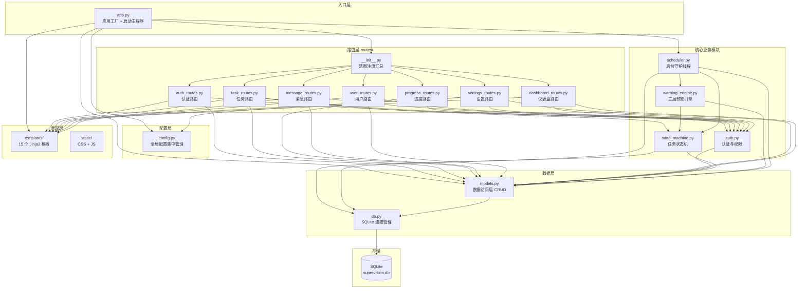
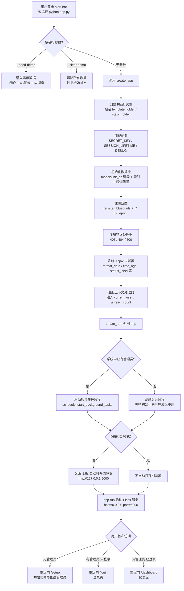
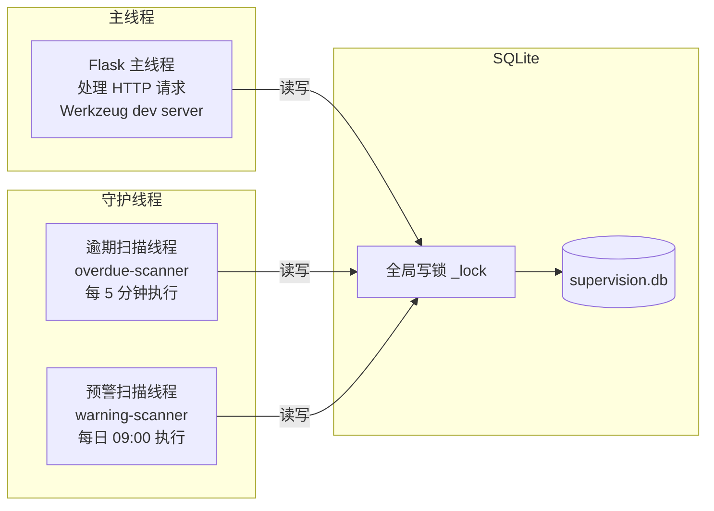

# 督办系统 — 系统架构设计

> **文档版本**：v2.1（v1.0 + V2 迭代增补 + V4 迭代增补）  
> **编写日期**：2025-08（v1.0）/ 2026-08-28（v2.0 增补）/ 2026-09-03（v2.1 增补）  
> **技术栈**：Python 3.10+ / Flask 3.x / SQLite / Jinja2 / PyInstaller  
> **适用范围**：小团队任务督办，本地单机或局域网部署  
> **V2 变更**：新增第 8 章「V2 架构增补」——抽屉交互契约（前端交互架构）、V2 数据库迁移机制、视觉体系；技术栈与分层架构不变（仍是 Flask + Jinja2 + 原生 JS + 单 CSS，无前端框架/构建工具/CDN 依赖）
> **V4 变更**：新增第 9 章「V4 架构增补（邮件通知）」——站内信之外的第二条通知通道。技术栈、分层模型、线程模型、打包方式**全部不变**，仅在三个既有业务出口挂钩子；详述六项关键权衡（落库队列 / 复用扫描循环 / 入队阶段合并 / 标准库加密 / 双重熔断 / 默认值保守）

---

## 目录

- [1. 技术栈选型](#1-技术栈选型)
- [2. 分层架构](#2-分层架构)
- [3. 模块划分图](#3-模块划分图)
- [4. 部署架构](#4-部署架构)
- [5. 启动流程](#5-启动流程)
- [6. 线程模型](#6-线程模型)
- [7. 设计决策与权衡](#7-设计决策与权衡)
- [8. V2 架构增补（抽屉交互 + 数据库迁移 + 视觉体系）](#8-v2-架构增补抽屉交互--数据库迁移--视觉体系)
- [9. V4 架构增补（邮件通知）](#9-v4-架构增补邮件通知)

---

## 1. 技术栈选型

### 1.1 整体技术栈

| 层级 | 技术选型 | 版本 | 选型理由 |
|------|---------|------|---------|
| 语言 | Python | 3.10+ | 开发效率高，标准库覆盖全面，适合小团队工具 |
| Web 框架 | Flask | 3.x | 轻量灵活，蓝图机制天然适配模块化拆分，学习成本低 |
| 模板引擎 | Jinja2 | 随 Flask | Flask 原生集成，服务端渲染无需前端框架 |
| 数据库 | SQLite | 3.x | 零配置、单文件、无需独立数据库服务，适合本地部署 |
| 数据库驱动 | sqlite3 | Python 标准库 | 无需额外安装第三方驱动 |
| 密码哈希 | werkzeug.security | 随 Flask | PBKDF2 算法，安全性足够，无需引入 bcrypt 等额外依赖 |
| 后台调度 | threading | Python 标准库 | daemon 线程实现定时扫描，无需引入 APScheduler/Celery |
| 打包工具 | PyInstaller | 6.x | 将 Python 应用打包为单 EXE，用户无需安装 Python 环境 |
| 前端样式 | 原生 CSS | — | 自定义样式，不依赖 UI 框架，减少打包体积 |
| 前端交互 | 原生 JavaScript | ES6+ | Fetch API + 轮询，不依赖 jQuery 等库 |

### 1.2 核心技术挑战与解决方案

| 挑战 | 解决方案 |
|------|---------|
| **SQLite 多线程并发** | `threading.local` 线程隔离连接 + 全局写锁 `_lock` 保证事务原子性 |
| **后台定时任务** | 两个 daemon 线程（逾期扫描 5 分钟 + 预警扫描每日 09:00），主进程退出自动终止 |
| **状态机一致性** | `change_task_status()` 使用 `db.transaction()` 上下文管理器，状态更新 + 日志 + 消息在同一事务内原子提交 |
| **预警消息去重** | `has_warning_today()` 按 task_id + recipient + type + 日期查询，同一天同类型只发一次 |
| **PyInstaller 打包路径** | `config.py` 区分 `FROZEN` 模式：打包后用 `sys._MEIPASS` 定位资源、`sys.executable` 定位数据目录 |
| **首次启动初始化** | `has_admin()` 检测无管理员时跳转初始化向导 `/setup`，避免硬编码默认账号 |

---

## 2. 分层架构

系统采用经典的三层架构，各层职责清晰、单向依赖：

```
┌─────────────────────────────────────────────────────────────┐
│                    表现层 (Presentation)                      │
│              Jinja2 模板 + 原生 CSS/JS 前端                   │
│  templates/ (15 个模板)  ·  static/css/main.css  ·  static/js/main.js
│  base.html(布局骨架) → 各功能页面继承扩展                     │
├─────────────────────────────────────────────────────────────┤
│                    业务层 (Business)                          │
│  routes/ (7 个 Blueprint)  ·  auth.py  ·  state_machine.py   │
│  warning_engine.py  ·  scheduler.py                          │
│  职责：HTTP 请求处理 · 权限校验 · 状态流转 · 预警判定 · 定时调度│
├─────────────────────────────────────────────────────────────┤
│                    数据层 (Data)                              │
│  models.py (CRUD 封装)  ·  db.py (连接管理)  ·  config.py    │
│  职责：SQL 执行 · 事务管理 · 连接池 · 配置读取                │
├─────────────────────────────────────────────────────────────┤
│                    存储层 (Storage)                           │
│              SQLite (data/supervision.db)                    │
│  5 张表：users · tasks · progress_logs · messages · system_config│
└─────────────────────────────────────────────────────────────┘
```

### 2.1 各层职责详述

#### 表现层（Presentation Layer）

- **模板引擎**：Jinja2 服务端渲染，所有页面基于 `base.html` 继承
- **自定义过滤器**：`format_date` / `format_datetime` / `time_ago` / `status_label` / `status_color` / `priority_label`，在 `app.py` 中注册
- **上下文注入**：每次渲染自动注入 `current_user` / `unread_count` / `warning_due_days` / `warning_inactive_days`
- **前端交互**：原生 JS Fetch API 实现 AJAX（侧滑面板加载、消息已读标记、未读数轮询）
- **模板清单（15 个）**：

| 模板路径 | 功能 |
|---------|------|
| `base.html` | 全局布局骨架（导航栏 + 内容区 + 侧滑面板容器） |
| `login.html` | 登录页面 |
| `setup.html` | 初始化向导（首次创建管理员） |
| `errors/403.html` | 权限不足错误页 |
| `errors/404.html` | 页面不存在错误页 |
| `errors/500.html` | 服务器内部错误页 |
| `dashboard/overview.html` | 仪表盘概览 |
| `tasks/list.html` | 任务列表（筛选 + 搜索 + 排序 + 分页） |
| `tasks/form.html` | 任务新建/编辑表单 |
| `tasks/detail.html` | 任务详情（侧滑面板内容） |
| `messages/list.html` | 消息列表 |
| `messages/send.html` | 管理员发消息表单 |
| `users/manage.html` | 用户管理 |
| `settings/profile.html` | 个人设置 |
| `settings/system.html` | 系统设置（预警配置） |

#### 业务层（Business Layer）

- **路由模块（routes/）**：7 个 Flask Blueprint，按功能域划分，每个蓝图负责对应领域的 HTTP 请求处理
- **认证模块（auth.py）**：密码哈希/校验、登录/登出、权限装饰器（`@login_required` / `@admin_required`）、数据级权限判断（`can_edit_task` / `can_delete_task`）
- **状态机模块（state_machine.py）**：5 态状态枚举、转换矩阵、转换校验、状态变更完整流程（含副作用：写日志 + 发消息）
- **预警引擎（warning_engine.py）**：三层预警判定逻辑（即将到期 / 已逾期 / 长期待激活），合并去重发送
- **调度器（scheduler.py）**：两个 daemon 线程，逾期扫描（每 5 分钟）+ 预警扫描（每日 09:00）

#### 数据层（Data Layer）

- **连接管理（db.py）**：线程安全的 SQLite 连接池（`threading.local`）、全局写锁、事务上下文管理器、快捷查询方法
- **数据访问（models.py）**：建表 SQL + 全部 CRUD 封装，按领域分为用户 / 任务 / 进度记录 / 消息 / 系统配置 / 仪表盘统计六大模块
- **配置管理（config.py）**：集中管理路径、安全、分页、扫描间隔、预警默认值、服务器等全局配置

---

## 3. 模块划分图



### 3.1 模块依赖关系说明

| 模块 | 依赖（import） | 被依赖 |
|------|---------------|--------|
| `app.py` | config, db, models, routes, scheduler | —（入口） |
| `config.py` | os, sys | app, models, db, scheduler, settings_routes |
| `db.py` | sqlite3, threading, config | models, state_machine, scheduler |
| `models.py` | os, datetime, config, db | 所有 routes, auth, state_machine, warning_engine, scheduler, app |
| `auth.py` | flask, werkzeug, models | auth_routes, task_routes, progress_routes, message_routes, user_routes, settings_routes, dashboard_routes |
| `state_machine.py` | datetime, db, models | task_routes, warning_engine, scheduler, app(Jinja过滤器) |
| `warning_engine.py` | datetime, models, state_machine | scheduler |
| `scheduler.py` | threading, time, datetime, config, db, models, warning_engine, state_machine | app |
| `routes/*` | flask, models, auth, state_machine, config | routes/__init__ → app |

---

## 4. 部署架构

### 4.1 部署模式

系统支持两种部署模式，均为单进程 Flask 应用：

```
模式一：本地单机部署（默认）
┌──────────────────────────────────┐
│         用户本机 (Windows)        │
│  ┌────────────────────────────┐  │
│  │  督办系统.exe (PyInstaller) │  │
│  │  ┌──────────────────────┐  │  │
│  │  │  Flask (127.0.0.1:5000)│  │  │
│  │  │  + SQLite 本地文件    │  │  │
│  │  │  + 后台守护线程 x2    │  │  │
│  │  └──────────────────────┘  │  │
│  │  浏览器自动打开 → localhost │  │
│  └────────────────────────────┘  │
└──────────────────────────────────┘

模式二：局域网共享部署
┌─────────────┐    HTTP    ┌─────────────────────────┐
│ 团队成员电脑 │ ────────→ │  部署机器 (0.0.0.0:5000) │
│  (浏览器)    │           │  Flask + SQLite + 线程   │
└─────────────┘           └─────────────────────────┘
```

### 4.2 运行时目录结构

```
督办系统.exe 同级目录/
├── 督办系统.exe              ← PyInstaller 打包产物
├── data/                     ← 运行时自动创建
│   └── supervision.db        ← SQLite 数据库文件（数据持久化）
└── (PyInstaller 临时解压目录 sys._MEIPASS)
    ├── templates/            ← Jinja2 模板（只读资源）
    └── static/               ← CSS/JS 静态资源（只读资源）
```

### 4.3 关键部署配置

| 配置项 | 默认值 | 说明 |
|--------|--------|------|
| `HOST` | `0.0.0.0` | 监听所有网卡，支持局域网访问 |
| `PORT` | `5000` | 监听端口 |
| `DEBUG` | `False` | 生产环境关闭调试模式 |
| `SECRET_KEY` | 硬编码 | Session 签名密钥（本地部署默认值） |
| `PERMANENT_SESSION_LIFETIME` | `604800` (7天) | Session 持久化时长 |
| `DATABASE_PATH` | `data/supervision.db` | 数据库文件路径（exe 同级） |

### 4.4 打包配置要点

- **资源路径分离**：`config.py` 中 `BUNDLE_DIR`（模板/静态资源）指向 `sys._MEIPASS`，`BASE_DIR`（数据库）指向 `sys.executable` 同级目录
- **关闭 reloader**：`app.run(use_reloader=False)` 避免 PyInstaller 打包后 reloader 导致重复启动
- **无外部依赖**：仅使用 Python 标准库 + Flask + werkzeug，打包体积可控

---

## 5. 启动流程



### 5.1 首次启动特殊流程

首次启动时数据库为空（无管理员账号），系统自动进入初始化向导：

1. `app.py main()` → `create_app()` → `models.init_db()` 建表
2. `has_admin()` 返回 False → 跳过后台线程启动
3. 用户访问 `/` → `auth.index()` 检测无管理员 → 重定向 `/setup`
4. 用户填写管理员信息 → `auth.setup()` POST → `models.create_user(role='admin')`
5. 重定向 `/login` → 用户用管理员账号登录
6. 后续重启时 `has_admin()` 返回 True → 后台线程正常启动

---

## 6. 线程模型

系统运行时包含 3 个线程：



### 6.1 线程安全机制

| 机制 | 实现位置 | 说明 |
|------|---------|------|
| 线程局部连接 | `db.py _local = threading.local()` | 每个线程持有独立的 SQLite Connection，互不干扰 |
| 全局写锁 | `db.py _lock = threading.Lock()` | `transaction()` 上下文内加锁，保证多线程并发写的串行化 |
| 外键约束 | `db.py PRAGMA foreign_keys = ON` | 每个连接创建时启用外键约束 |
| 跨线程连接 | `check_same_thread=False` | 允许守护线程使用连接（配合 threading.local 隔离） |

### 6.2 后台线程职责

| 线程 | 名称 | 循环间隔 | 职责 |
|------|------|---------|------|
| 逾期扫描 | `overdue-scanner` | 300 秒（可配置） | 查找 pending/in_progress 且超截止日期的任务 → 标记 overdue → 写系统日志 → 触发逾期预警消息 |
| 预警扫描 | `warning-scanner` | 60 秒检查 | 到达配置时间（默认 09:00）且当天未扫描 → 执行三层预警扫描 |

---

## 7. 设计决策与权衡

### 7.1 为什么选择 Flask 而非 Django

| 维度 | Flask | Django |
|------|-------|--------|
| 体积 | 轻量，打包后体积可控 | 重量级，PyInstaller 打包体积大 |
| 灵活性 | 蓝图自由拆分，架构自定 | MTV 模式固定，定制成本高 |
| 依赖 | 仅 Flask + werkzeug | Django 全家桶，依赖链长 |
| 适用 | 小团队工具、本地部署 | 中大型 Web 项目 |

**结论**：督办系统是面向小团队的本地工具，Flask 的轻量性更契合打包部署需求。

### 7.2 为什么选择 SQLite 而非 MySQL/PostgreSQL

- **零配置**：无需安装数据库服务，单文件即数据库
- **本地部署**：数据随 exe 走，用户无需管理数据库
- **性能足够**：小团队（数十人）并发量低，SQLite 完全胜任
- **事务支持**：完整 ACID 事务，满足状态机原子性需求

### 7.3 为什么选择服务端渲染（Jinja2）而非前后端分离

- **打包简单**：模板随 exe 打包，无需独立前端构建
- **SEO 无关**：内部工具不需要搜索引擎收录
- **开发效率**：一个全栈开发者即可完成前后端，适合小团队
- **交互需求低**：仅侧滑面板和消息轮询需要 AJAX，原生 JS Fetch 足够

### 7.4 为什么使用 daemon 线程而非 Celery/APScheduler

- **无外部依赖**：threading 是 Python 标准库，打包无额外成本
- **部署简单**：无需 Redis/RabbitMQ 消息队列
- **功能足够**：两个简单的定时扫描任务，不需要分布式任务队列
- **生命周期简单**：daemon=True 随主进程退出自动终止

### 7.5 V2：为什么选择"整页渲染 + 片段注入"而非 SPA（V2 增补）

- **保留多页架构**：页面主体仍由 Jinja2 服务端整页渲染，仅抽屉内容通过片段路由按需 fetch 注入
- **零框架零构建**：不引入 React/Vue、不引入 Webpack/Vite、不依赖 CDN，PyInstaller 离线打包零风险
- **权限不下放前端**：片段由服务端渲染时重算权限与数据，前端不维护状态，杜绝状态陈旧
- **渐进增强**：JS 失效时任务详情独立页（`/tasks/<id>`）仍可用，核心流程不中断

---

## 8. V2 架构增补（抽屉交互 + 数据库迁移 + 视觉体系）

### 8.1 抽屉交互契约（前端交互架构）

V2 重写 `static/js/main.js` 与 `templates/base.html`，建立"整页渲染 + 局部片段注入"的混合模式。

#### 8.1.1 抽屉管理器（drawer 对象）

`base.html` 提供全局**唯一**抽屉容器，三类抽屉（任务详情 / Owner / 消息）共用：

| DOM 节点 | 职责 |
|----------|------|
| `#drawer-main` | 抽屉主体（加/去 `open` class 控制滑入滑出） |
| `#drawer-main-body` | 片段注入区（innerHTML 替换） |
| `#drawer-overlay` | 背景遮罩（点击关闭） |
| `#toast-container` | Toast 通知容器（右下角） |

`main.js` 中 `drawer` 对象的三个方法：

- **`drawer.open(url)`**：`fetch(url, {headers: {'X-Requested-With': 'XMLHttpRequest'}})` → 响应为 HTML 片段，注入 `#drawer-main-body`；若 `resp.redirected`（如登录态失效被重定向到 `/login`）则整页跳转；请求失败展示错误占位。
- **`drawer.reload()`**：用记录的 `currentUrl` 重新 `open()` —— 所有抽屉内操作成功后的统一刷新方式（服务端重新渲染权限与数据，前端不维护状态）。
- **`drawer.close()`**：移除 `open` class、清空注入区、恢复页面滚动；ESC 键 / `.drawer-close` 按钮 / 点击遮罩三种途径触发。

页面级脚本通过 `window.DB = {toast, drawer, pollUnreadCount}` 访问这些能力。

#### 8.1.2 选择器契约（事件委托）

所有抽屉内交互均通过 `document` 级**事件委托**绑定（片段动态注入后无需重新绑定），选择器与行为的对应关系是模板片段与 `main.js` 之间的硬契约：

| 选择器 / 属性 | 行为 |
|---------------|------|
| `[data-drawer]`（任务行/焦点列表行） | 打开 `data-drawer` 属性值指定的任务抽屉 URL；点击目标命中 `a, button, input, select, textarea, label` 时忽略（不拦截行内操作按钮） |
| `.drawer-close`、`#drawer-overlay`、ESC 键 | 关闭抽屉 |
| `.drawer-tabs button[data-tab]` | 页签切换：激活对应 `.drawer-tab-pane`（`active` class 互斥） |
| `.inline-field.editable .field-value` | 行内编辑：点击原位变输入框（容器属性见 8.1.3） |
| `form.drawer-form` | AJAX 表单提交（FormData + `X-Requested-With` 头）→ JSON → Toast + `drawer.reload()`（响应含 `reload_page` 时整页刷新） |
| `.remind-btn[data-url]` | POST 推送提醒 → Toast |
| `.resolve-blocker-btn[data-url]` | POST 标记阻塞解决 → Toast + reload |
| `.delete-evidence-btn / .delete-blocker-btn [data-url]` | `confirm` 二次确认 → POST 删除 → Toast + reload（仅 admin 可见） |
| `.drawer .message-item[data-message-id][data-task-drawer]` | 未读则 POST 标记已读；有 `data-task-drawer` 则打开关联任务抽屉 |
| `#drawer-mark-all-read` | POST 全部已读 → Toast + reload + 刷新红点 |
| `#bell-btn` | 打开 `/messages/drawer` 消息抽屉 |
| `#unread-badge` | 未读数徽标（`/messages/unread-count` 30 秒轮询，>99 显示 `99+`，0 时隐藏） |
| `#theme-toggle` | 切换 `html.dark` class，偏好存 `localStorage('db-theme')`，默认浅色 |
| `#nav-toggle` / `#mobile-nav` | 移动端汉堡菜单展开/收起 |

#### 8.1.3 行内编辑契约

抽屉详情页签中每个可编辑字段为一个 `.inline-field` 容器，携带以下 data 属性：

| 属性 | 含义 |
|------|------|
| `data-field` | 字段名（须在路由层白名单内） |
| `data-type` | 控件类型：`text` / `textarea` / `number`（进度，min 0 max 100）/ `date` / `select` |
| `data-url` | 保存端点，固定为 `/tasks/<id>/field` |
| `data-options` | select 类型的选项 JSON（`[[value, label], ...]`，如优先级、负责人下拉） |
| `data-raw` | 当前原始值（编辑起点与回滚值） |

编辑流：点击 `.field-value` → 按类型构造控件 → 失焦或回车保存（值未变化则跳过）→ `POST /tasks/<id>/field`（JSON `{field, value}`）→ 成功 Toast + 进度% 联动刷新进度条；失败 Toast + 回滚显示原值；ESC 取消。

**权限下沉到模板**：片段渲染时由 `can_edit` 决定容器是否携带 `editable` class（无该 class 点击无反应）；`assignee` 字段额外要求 `current_user.role == 'admin'` 才带 `editable`。前端只做展示控制，最终权限由路由层白名单 + `can_edit_task` 二次校验。

#### 8.1.4 片段渲染模式

- 后端提供 3 个片段路由（`/tasks/<id>/drawer`、`/tasks/owner/<uid>/drawer`、`/messages/drawer`），渲染 `_` 前缀局部模板（`tasks/_drawer.html`、`tasks/_owner_drawer.html`、`messages/_drawer.html`），**不含 base.html 骨架**。
- 片段模板顶部注释声明其选择器契约（与 8.1.2 表格对应）。
- 所有写操作成功后 `drawer.reload()` 重新拉取片段，服务端重算权限与数据，杜绝前端状态陈旧。

### 8.2 V2 数据库迁移机制（老库无缝升级）

V1 老数据库无需手工操作，启动时自动升级到 V2 结构。迁移逻辑位于 **`models.py` 的 `_migrate_v2()`**（`db.py` 仅提供连接与事务，不含迁移逻辑），由 `init_db()` 末尾调用：

```
init_db()
 ├── 建表（CREATE TABLE IF NOT EXISTS × 5 张 V1 表）
 ├── 建索引 + 写默认配置
 └── _migrate_v2()                     # V2 迁移，幂等可重复调用
      ├── ① CREATE TABLE IF NOT EXISTS evidence / blockers + 索引
      │      （IF NOT EXISTS 天然幂等，新老库统一走这一步）
      └── ② tasks 补 3 列
             PRAGMA table_info(tasks) 取现有列名集合
             逐列检查 progress_percent / risk_note / collaborators
             缺列才执行 ALTER TABLE tasks ADD COLUMN <col> <def>
             （SQLite ADD COLUMN 秒级完成，数据不丢）
```

**设计要点**：

| 要点 | 说明 |
|------|------|
| 幂等性 | 建表走 IF NOT EXISTS；补列先查 `PRAGMA table_info` 再 ALTER，重复启动零副作用 |
| 数据安全 | 只做加表/加列（带默认值），不修改、不删除任何 V1 数据 |
| 容错 | 迁移整体 try/except，异常打印日志（`[migrate_v2]` 前缀）但**不中断启动** |
| 时机 | 应用启动 `init_db()` 时执行，与首次建库共用同一条路径 |

### 8.3 视觉体系（V2）

- **CSS 变量双套**：`:root` 浅色默认 + `html.dark` 覆盖深色（`main.css` 单文件，无 CSS 框架）。
- **状态徽章**：`.status-badge.st-<status>`（`st-pending` 灰 / `st-in_progress` 琥珀 / `st-overdue` 红 / `st-closed` 绿 / `st-cancelled` 浅灰）；优先级药丸四级配色不变。
- **图标**：`templates/macros/icons.html` 以 Jinja2 宏（`{{ icon('bell', 14) }}`）内联 Lucide SVG，约 25 个图标，零外部依赖。
- **字体**：系统字体栈（`Inter, Segoe UI, PingFang SC, Microsoft YaHei` 等），**不内嵌字体文件**（离线打包体积考虑）。
- **Toast**：`#toast-container` 右下角滑入，3 秒自动消失（成功绿/失败红/信息蓝）；flash 消息自动转发为 Toast，flash 本体保留 3 秒淡出作兜底。
- **响应式断点**：≥1024px 桌面两栏 / 768–1023px 平板单栏 / <768px 手机（抽屉全屏、导航收进汉堡菜单）。

---

## 9. V4 架构增补（邮件通知）

> **变更日期**：2026-09-03　　**需求溯源**：`docs/督办系统-V4邮件功能需求清单.md`（55 项决策 A1~I6 已锁定）
> **代码级细节**：见 `docs/architecture-design.md` 第十三章。本章只讲**选型与权衡**。

### 9.0 一句话概况

V4 在既有架构里新增了一个**「通知通道」维度**：站内信之外再加一条邮件通道。技术栈、分层模型、线程模型、打包方式**全部不变**，业务层（任务状态机、预警引擎的逻辑）**零改动**——只在三个既有的业务出口上挂了钩子。

这个「不动存量」的结果不是偶然，是需求阶段就定下的约束：邮件只是附加通道，它挂了不该让预警本身消失。

### 9.1 在分层架构中的位置

| 层级 | V4 新增内容 | 是否侵入既有代码 |
|------|------------|----------------|
| 表现层 | `templates/mail/status.html`（管理员状态页）、`templates/mail/my.html`（个人记录） | 否，纯新增 |
| 路由层 | `routes/mail_routes.py`（8 条路由，新蓝图） | 否，独立蓝图 |
| 业务层 | `mail_dispatcher.py`（入队/扫描/重试/熔断）、`mail_templates.py`（正文渲染）、`mail_service.py`（SMTP）、`crypto_util.py`（加密）、`mail_constants.py`（常量） | 否，纯新增 6 个模块 |
| 数据层 | `models._migrate_v3()`（2 张新表 + users 补 2 列）、约 30 个邮件 CRUD 函数 | **加表加列，不改既有任何表** |
| 调度层 | 复用既有逾期扫描 5 分钟循环 | 加了 1 行调用 |
| 配置层 | `config.py` 新增 14 个 `MAIL_*` 默认值 | 否，纯新增常量 |

三处**唯一的存量改动**（都是加一行函数调用，不改原逻辑）：

```
scheduler.py:65        → mail_dispatcher.scan_and_send()          # 队列扫描
warning_engine.py:84   → _enqueue_warning_mails()                 # 每日 09:00 入队
warning_engine.py:182  → enqueue_overdue_warnings(task=task)      # 任务刚逾期
task_routes.py:976     → enqueue_assignment(...)                  # 新建/改派
task_routes.py:1228    → enqueue_manual(...)                      # 手动发送按钮
```

`models.create_message()`（站内信主通道）**一行没动**。

### 9.2 为什么不直接发送，而要落库队列

| 维度 | 直接发送（触发即发） | 落库队列（V4 选择） |
|------|------------------|------------------|
| 进程被杀 | 在途邮件直接丢失 | 记录留库，重启后继续发 |
| 失败重试 | 需要在内存里维护重试状态，重启即丢 | `retry_count` + `next_attempt_at` 落库，天然持久化 |
| 限流 | 并发触发时无法控制节奏 | 每轮 `batch_limit` 封，平滑可控 |
| 去重 | 靠内存缓存，多实例失效 | `dedup_key` UNIQUE 索引，跨重启生效 |
| 可观测性 | 发完就没了，出问题只能翻日志 | 队列积压数、失败清单都是 SQL 可查的 |
| 复杂度 | 低 | 中（多 2 张表 + 1 个扫描步骤） |

**结论**：多付两张表的代价，换「重启不丢邮件」和「失败能追、能重发」这两条。对督办系统这种「漏通知 = 督办失效」的场景，这两条是刚需。

被否决的备选：用 Flask 的 `after_request` 或后台线程异步发。问题是进程一退，队列里的东西全没——而本系统是 exe 双击启动的，用户随时可能关窗口。

### 9.3 为什么复用既有 5 分钟扫描，而非新增线程

| 方案 | 评价 |
|------|------|
| 新增独立邮件线程 | 多一个线程就多一处并发写库；5 分钟对邮件提醒已经足够及时 |
| APScheduler | 新增依赖，要重打包 exe（本项目踩过这个坑） |
| **复用逾期扫描循环**（选择） | 零新增线程、零新增依赖；循环内独立 try/except，互不影响 |

代价是邮件最快要等 5 分钟才发出。这个延迟被接受，因为：
- 绝大多数邮件来自每日 09:00 的预警扫描，本来就是批量定时任务，不差 5 分钟；
- 真正需要「立刻」的两处都做了特例——**手动发送**在入队后立刻同步发一次，**测试邮件**完全不走队列。

### 9.4 为什么在入队阶段按人合并，而不是发送阶段聚合

50 个任务 × 10 个人，逐任务发是 **500 封/天**；按负责人合并 + 管理员日报后约 **30 封/天**。个人邮箱日发 500 封必然触发服务商风控。

| 方案 | 问题 |
|------|------|
| 发送阶段聚合 | 队列里是一堆零碎任务，发送时才临时合并。一旦一批里部分成功，重试就要处理「半批」状态，复杂度暴涨 |
| **入队阶段合并**（选择） | 每人每天只生成**一条**队列记录，正文里列出他名下的全部逾期任务。队列记录与物理邮件一一对应，重试/限流/去重都是单条粒度 |

代价：去重键必须是「人 + 日期」而不是「任务 + 人 + 日期」，否则第二个任务会被挡在门外、进不了那封合并邮件。这是 F2-② 与 C6-② 两处决策咬合的地方，改任一个都要同步改另一个。

> **已确认口径一（2026-09-03 用户拍板）**：管理员本人是某个任务的负责人时，逾期提醒**照发**，不做豁免。
> 详细依据与备选方案见 `docs/architecture-design.md` §13.6。

### 9.5 为什么用标准库自建加密，而非引入 cryptography

设置页要存 SMTP 密码（授权码），存明文等于把邮箱钥匙写在数据库文件里。

| 方案 | 代价 |
|------|------|
| 引入 `cryptography` 用 AES-GCM | 需要动 requirements.txt + `.spec` 的 hiddenimports + 装进托管解释器 + **重新打包 exe**。本项目在加 openpyxl 时完整走过一遍，深知成本 |
| **标准库 PBKDF2 + SHAKE256 XOR**（选择） | 零新增依赖；代价是算法不是工业标准 |

**为什么这个代价可以接受**：本场景要防的是「有人拷走了数据库文件，用文本编辑器打开瞄一眼」。自建方案足以挡住这个级别。若要过等保或正式安全审计，仍需换成 AES——这一点在代码注释和交付文档里都写明了，**没有夸大**。

刻意保留的两个降级行为：
- `secret.key` 丢失时 `decrypt()` 返回 `None` 而非抛异常，上层提示「请重新填写密码」，不会让整个请求 500；
- `is_available()` 让设置页提前判断，不可用就不让填，避免「填完了才发现存不进去」。

### 9.6 为什么是双重熔断，而不是统一一套

两类故障的**恢复条件根本不同**，用一套规则必然顾此失彼：

| 故障 | 特征 | 处理 | 恢复方式 |
|------|------|------|---------|
| 认证失败 / 判定垃圾邮件 | 配置错了，重试一万次也是错 | 立即熔断 | **人工点「恢复发送」** |
| 网络中断 / 服务商限流 | 环境问题，一会儿可能自己好 | 连续失败 10 封后熔断 | **60 分钟后自动试探** |

**为什么认证失败要人工恢复**：密码错了还一直试，一天就是几千次失败登录，很可能把发件邮箱账号直接封掉。这个代价比「暂停发信」大得多，所以宁可麻烦管理员点一下。

**为什么连续失败要自动试探**：断网、服务商临时故障是常见且自愈的。若也要求人工恢复，一次夜间网络抖动就能让第二天的督办邮件全停。

> **已确认口径二（2026-09-03 用户拍板）**：在设置页保存配置**不自动解除熔断**，恢复只有「恢复发送」按钮这一条路径。
> 理由：管理员可能只是改了端口或落款，SMTP 账号密码其实还是错的，自动恢复会立刻再撞一次认证失败。把「确认配置已修正」做成一个显式动作更稳。
> 详细依据见 `docs/architecture-design.md` §13.9。

### 9.7 为什么默认值必须保证「不配置 = 行为不变」

这是 V4 最重要的一条非技术约束，它来自部署形态：**本系统是打包成 exe 分发到目标机器的，目标机器上通常没有 `.env` 文件。**

因此：
- `MAIL_ENABLED` 默认 `False`，`MAIL_SMTP_HOST` 默认为空 → 不配置时邮件功能完全不激活；
- 行为与 V3 完全一致，已发行的离线程序不会因为升级而**突然开始往外发信**。

推论（写进团队规范）：**新增任何 env 覆盖项时，默认值必须让「不配置 = 行为不变」成立。** 改默认值等于改所有已部署实例的行为，而那些实例你碰不到。

同理，也刻意**没有引入 python-dotenv**：`config.py` 里 20 行极简 `.env` 解析已够用，新增依赖意味着重打包 exe。

### 9.8 为什么邮件是「附加通道」而非「主通道」

| | 站内信 | 邮件 |
|---|-------|------|
| 配置成本 | 零 | 要配 SMTP、要每个人填邮箱 |
| 可靠性 | 系统内部闭环 | 依赖外部服务商，可能被拒、被判垃圾 |
| 定位 | **主通道** | **附加通道** |

由此推出一条贯穿全部实现的降级原则：**静默降级**。未配置、没填邮箱、订阅等级不含、去重命中、不在降频序列、熔断未恢复——六种情形一律静默跳过，不报错、不告警、不在界面刷存在感。

反过来，邮件链路的所有异常都**不能**影响站内信。`warning_engine` 与 `scheduler` 里各有一处独立 `try/except` 守着这条底线。

### 9.9 V4 对既有架构的影响小结

| 维度 | V3 | V4 | 变化性质 |
|------|-----|-----|---------|
| 技术栈 | Flask + SQLite + Jinja2 | 同左 | **不变** |
| 数据库表 | 7 张 | 9 张（+email_queue / email_log） | 加表，不改存量 |
| 后台线程 | 2 个（逾期扫描 / 预警扫描） | 2 个 | **不变** |
| 第三方依赖 | Flask（+ openpyxl） | 同左 | **不变** |
| 打包方式 | PyInstaller onedir | 同左 | **不变** |
| 业务层逻辑 | 状态机 + 3 层预警 | 同左 + 5 处挂钩 | 加钩子，不改逻辑 |
| 配置项 | 8 个 env 覆盖项 | 22 个（+14 个 MAIL_*） | 加常量，默认值保守 |
| 单测用例 | 145 | 212 | 新增 67 项 |

---

> **文档结束** — 督办系统系统架构设计 v2.1（v1.0 基线 + V2 增补：抽屉交互契约 / 数据库迁移机制 / 视觉体系 + V4 增补：邮件通知通道的选型与权衡）
