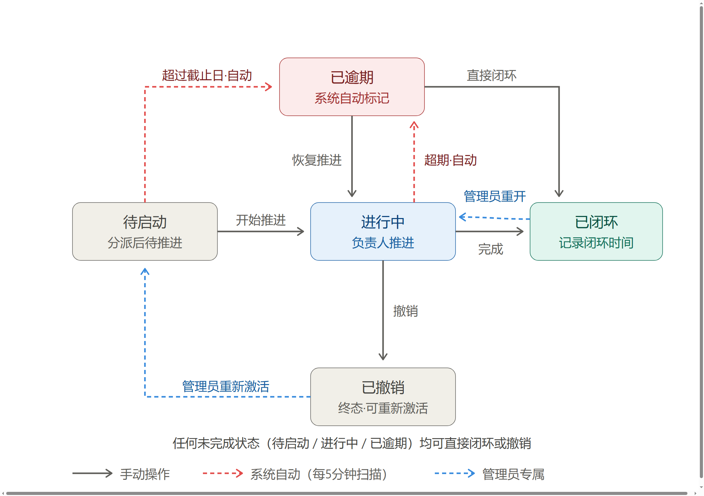
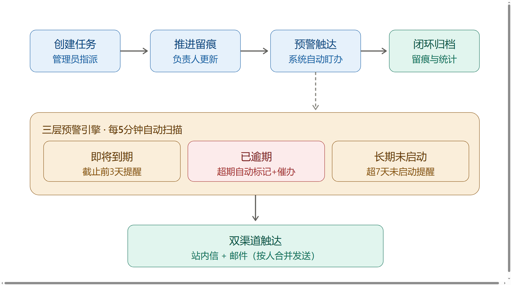

# 督办系统 Demo 演示话术脚本

> **给演示者看的说明（演示前请删除或仅自己参考）**
> - 建议时长：正式演示 15–20 分钟，含互动 5–10 分钟。
> - 演示环境：用已灌好演示数据的实例（建议 1 个管理员 + 2–3 个负责人账号；含若干「进行中 / 已逾期 / 长期未启动」的任务，以便直接展示预警）。
> - 网络：邮件与站内信用本地或测试账号演示即可。
> - 话术中【】内为演示者动作/提示，不念给观众听。

---

## 一、开场白（约 1.5 分钟）

**【切到登录页或概览页，先不操作，面向观众】**

各位好，很高兴今天用 15 分钟带大家实际跑一遍我们的**督办系统**。

先说背景：大家平时手里的任务散在微信群、邮件、会议纪要么里，谁跟进、到哪一步、是不是要到期了，全靠人肉记、靠问。任务一多就漏、就逾期、就推不动。

我们这套系统的核心价值就一句话——**把分散的任务统一收口到一个池子里，自动盯进度、到点提醒、闭环留痕**，让「该谁做、做到哪、有没有逾期」一目了然，减少催办的人力成本。

它不是另起一套流程，而是把大家已经在做的事情**收拢到同一个界面**。接下来我按一个任务从「建」到「闭环」的真实路径走一遍，重点演示到点自动预警。

---

## 二、分步演示解说词

### 步骤 0：登录与两种角色（约 1 分钟）

**【展示登录页 → 用管理员账号登录 → 再提一句负责人视角】**

系统有两种角色：

- **管理员**：能看到全局、派任务、看所有预警、收汇总；
- **负责人**：只看到自己名下的任务，跟进、更新进度、上传佐证。

【演示时可快速切到负责人账号看一眼「我的任务」，再切回管理员，突出「各看各的、但同池同数据」。】

核心设计是**一个统一任务池**——不分什么「我的 / 部门的 / 临时的」，所有行动进同一个池，权限只控制你能看见和操作哪一部分。

---

### 步骤 1：概览页——一眼看全局（约 2 分钟）

**【进入「概览」】**

登录进来第一眼就是概览。这里有几张关键卡片：任务总数、**待启动 / 进行中 / 已逾期 / 已闭环**，以及**闭环率**。

下面是按负责人拆分的进度表——谁手上有几个、几个逾期、闭环率多少，这张表基本就是月度督办会的底稿。

【可以点一下某位负责人那一行，展示下钻，再回到概览。念稿时强调「逾期这个数是系统自己算的，不是人填的」。】

---

### 步骤 2：创建任务——统一收口（约 2.5 分钟）

**【进入「任务」→ 点「新建任务」】**

新建一个任务只要填这几项：标题、负责人、截止日期、优先级、说明。

【边填边说】注意这里**负责人是必选的**，任务一旦建好就进入统一池，负责人马上能在「我的任务」里看到。

创建完不进普通列表——它会出现在任务列表里，状态默认是**「待启动」**。这就是我们说的 5 个状态的第一格。

---

### 步骤 3：状态流转——5 态状态机（约 3 分钟）

**【打开一个任务的详情抽屉】**

每个任务走一套固定的状态机，一共 **5 个状态**：

1. **待启动** —— 建好还没动手；
2. **进行中** —— 负责人开始跟进；
3. **已逾期** —— 过了截止日还没闭环，系统会自动标红；
4. **已闭环** —— 完成、留痕；
5. **已撤销** —— 作废，但保留记录可追溯。

【点开任务详情抽屉，依次点状态切换，展示卡片式的时间线/消息。强调：】「已逾期」是**一个真实状态**，不是打个标签——它会被概览、预警、负责人统计统一算进去。

闭环和撤销是终态，但可以**重新打开**，方便撤回误操作或任务复活。

---

### 步骤 4：三层预警 + 双渠道触达（约 3.5 分钟，本场高潮）

**【切到「消息」或「邮件」页，或直接在概览指出逾期项】**

任务多了最怕「没人盯」。系统每 5 分钟自动扫描一次，按**三层预警**主动提醒：

- **第一层 · 即将到期**：截止日前 **3 天**（可配），提醒负责人「还有 3 天，该跟进了」；
- **第二层 · 已逾期**：过了截止日还没闭环，升级提醒；
- **第三层 · 长期待激活**：建了 **7 天**还没启动，提醒「别让它凉了」。

【展示一条站内信示例】触达走**双渠道**：站内信 + 邮件。而且做了**去重**——同一任务同一人同一天同一类提醒只发一条，不会轰炸。

【若演示环境已配好邮件，可当场点「发送测试邮件」或展示一封已发出的预警邮件；否则口头说明即可。】

---

### 步骤 5：闭环与留痕（约 1.5 分钟）

**【把刚才那个任务推进到「已闭环」】**

负责人跟进完，在任务里更新进度、上传佐证材料，然后点「闭环」。

闭环后这条任务计入**闭环率**，所有操作、消息、状态变更都留在时间线里，**事后可查、责任可追**。撤销的任务同理保留轨迹。

---

### 步骤 6：AI 辅助（管理员，约 2 分钟，可选）

**【顶部导航点击「AI 辅助」→ 进入 `/ai` 控制台；若未启用会提示如何配置，不报错】**

系统给管理员内置了一个 **AI 辅助**入口（顶部导航栏，移动端在下拉里也有）。它跑在**本机 / 内网的本地模型上**，数据**不出这台机器**——这点对内部督办场景很关键，也符合我们「数据可控」的底线。

管理员进去能看到几类现成卡片：

- **催办话术生成**：选一个逾期或临期任务，一键生成一段发给负责人的催办话术草稿；
- **简报 / 周报草稿**：把当前预警、逾期、各负责人进度汇成一段可复制的文本，月度督办会前直接拿去改；
- **敏感数据脱敏默认开启**：生成内容时，姓名、电话、账号等会自动打码，需要原文时再手动放开，**默认不泄露**。

【演示要点：强调「AI 只是出草稿，最终发出前由人确认」——所有 AI 生成的内容都要管理员**人工确认后才真正发送**，不会出现「系统替你发了什么」。可现场选一条逾期任务点「生成催办话术」展示草稿，再点「复制」或「人工确认发送」。】

> 启用前提（现场清单见 `docs/AI功能现场部署清单.md`）：本机装好 Ollama 并拉取 `qwen2.5:7b`，在 `.env` 里把 `AI_ENABLED=true` 打开、重启程序即可。未配置时入口照常显示，点进去会引导配置。

### 关于后续增强能力

**【演示者提示：本场聚焦核心督办闭环（建—跟—预警—闭环）+ AI 辅助入口。企微 / 钉钉 / SSO 集成、批量导入等仍是规划项，本次点到为止，不展开以免给听众不完整的印象。】**

---

## 三、互动环节（约 5–10 分钟）

**【讲完主流程后，主动停下来，用下列问题引导】**

- "大家平时任务主要散在哪些渠道？今天看到的统一池，哪些能直接切过来？"
- "三层预警的阈值（3 天 / 7 天），你们实际想设成几天？"
- "负责人维度那张表，月度督办会是不是直接能用？还想加什么字段？"
- "AI 生成的催办话术 / 简报，你们希望默认给谁看、要不要人工确认才发？"

【演示者注意：把回答记下来，尤其是「阈值想改几天」「要不要邮件」「AI 给谁看」——这些都是后续配置和二期需求的输入。】

---

## 四、总结与后续跟进（约 1.5 分钟）

**【回到概览页，做一个收尾】**

小结一下：今天我们跑通了任务从**建 → 跟 → 预警 → 闭环**的全链路，核心价值就是**统一收口、自动盯办、闭环留痕**。（演示环境已启用 AI 辅助的，可顺带提一句「连催办话术和周报草稿都能本地模型直接出，数据不出内网」。）

下一步我们建议：
1. **小范围试点**——选一个你们最痛的业务线，导入 20–30 条真实任务跑两周；
2. **对齐预警阈值与通知方式**（站内信 / 邮件）；
3. 试点后我们再根据反馈微调，再考虑推广。

今天演示的数据是样例，你们的真实数据导入我们后续单独配合。谢谢大家，下面 Q&A。

---

## 五、常见疑问预设应对（FAQ）

**Q1：和我们现在的微信群 / 在线文档有什么区别？**
A：不是替代，是收口。群和文档里的任务容易沉底、没人盯；这里把任务变成**带状态、带截止日、系统自动提醒**的对象，到期不闭环会一直冒红，责任清晰。

**Q2：负责人会不会嫌多一个系统？**
A：负责人视角很轻——只看到自己名下的任务，更新进度、上传个佐证就行，不用学复杂功能。重活在管理员侧自动完成。

**Q3：逾期是怎么判定的？会不会误报？**
A：完全按**截止日期 + 实际状态**机器判定，不靠人填。只要没闭环、过了截止日，就自动进入「已逾期」。不会漏，也不会凭空造。

**Q4：预警会不会天天轰炸？**
A：做了**去重**——同一任务、同一人、同一天、同一类提醒只发一条；已逾期类按天提醒，不会每条都弹。阈值（3 天 / 7 天）也都能配。

**Q5：数据安全吗？邮件密码会不会泄露？**
A：邮件密码加密存储、不进日志、不在页面以明文展示，传输走加密连接；系统仅在内网 / 本机部署，数据不出可控范围。

**Q6：能接企业微信 / 钉钉 / 现有 SSO 吗？**
A：当前是独立账号体系，先把核心督办闭环跑顺。企微 / 钉钉 / SSO 是规划中的集成项，试点稳定后按需求排期。

**Q7：任务能批量导入吗？历史任务怎么办？**
A：支持新建与批量操作；历史任务可整理后一次性导入统一池，从「待启动 / 进行中」接续跟进，已有进度照常记录。

**Q8：手机上能用吗？**
A：界面是 Web + H5 响应式，手机浏览器直接打开就能看任务、收消息、更新进度，不用装 App。

**Q9：误操作闭环 / 撤销了能恢复吗？**
A：可以。闭环、撤销都是终态但**可重新打开**，误关的任务能复活继续跟进，记录全程保留。

**Q10：这套能撑多大体量？**
A：当前面向组织内部督办场景（数十到数百任务 / 数十用户）设计，5 分钟自动扫描 + 去重限流保证了稳定；更大规模可按需做性能与部署加固。

**Q11：AI 生成的内容会直接发出去吗？会不会泄密？**
A：不会自动发。所有 AI 草稿都要管理员**人工确认**后才真正发送；且默认开启敏感数据脱敏，姓名 / 电话 / 账号等会自动打码。模型跑在本地 Ollama，**数据不出这台机器**。

---

*脚本版本：V2（随系统 V5 能力对齐：5 态状态机 + 三层预警双渠道 + AI 辅助入口；流程图见 `docs/assets/`） · 演示前请按本环境实际数据微调步骤 2/4 的具体任务与阈值，并按 `docs/AI功能现场部署清单.md` 确认 AI 是否已启用。*
